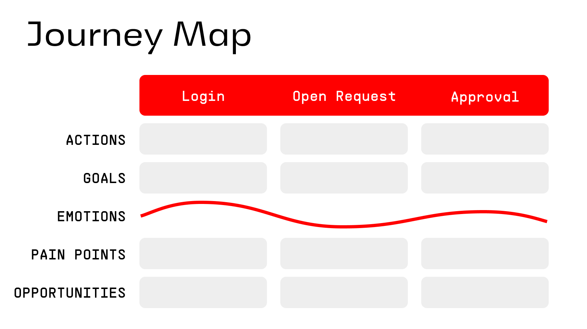

# Journey Mapping

## What is it?

Journey Maps are a visual representation of an individual’s experience across stages, actions, emotions, and pain points. It can be applied to user journeys (specific product/service usage) or customer journeys (broader relationship with an organization). Maps may represent the current state \- showing all of the pains and frustrations of the user today, or represent a target vision of an experience a team is striving to deliver.

## Why do it?

Mapping these processes help teams align around a shared understanding of an end-to-end experience. It will reveal pain points, friction, and moments of delight so that decision-making is grounded in empathy around the user and/or customer experience. These maps help tell a narrative and can be used to share information and align cross-functional teams. These maps serve as a strong visual representation to help communicate design, strategy and priorities.

## When to do it?

Run this play to build a map of the current state after you have some insight into the experience you want to map (such as from research, analytics, or stakeholder input) \- but before detailed solution design or implementation begins. Build a target/future state journey map after you know the outcomes your team is trying to achieve and you want a way to visually represent an experience for a future state of a product or service.

## Who to Involve?

Journey maps are a key tool in a User Experience Designer’s toolbox \- and are typically led by a Designer. A full balanced team should be a part of the activity to build shared understanding across the team. Journey Maps can be built as a research synthesis artifact or built collaboratively with a user or customer.

## Tools You Might Need

**In Person:** Whiteboard/butcher paper, stickies, markers  
**Digital:** Whiteboard tool such as FigJam, Mural, etc

In either case you should have your defined personas, and research insights \- interview quotes, analytics, support tickets, survey results, etc that would help you understand the experience across an end-to-end journey.

## Time You Might Need

About an hour \- for more complex journeys, extend to 90 minutes.

## How to do it (Steps)

1. **\[Prerequisite\] Gather Research Insights.** Pull together all relevant information:
      * Qualitative: user interviews, customer feedback, observational notes
      * Quantitative: analytics, funnel data, transaction records
      * Existing personas or audience segments
1. **Prep the Template & Agenda**
      * Choose a journey scope (e.g., onboarding, purchasing, support request, full lifecycle). Determine the bookends for your map.
      * Set up your map structure: Phases → Actions → Goals → Thoughts/Feelings → Pain Points → Opportunities.
3. **Set the Stage (5 min)**
      * Kick off the session with what we’ll be accomplishing and why we are focused on this.
      * Introduce the persona, the templates and the bookends of the journey.
4. **Define Phases of the Journey (10 min)**
      * Fill in the high level journey steps between your determined “bookends.”
5. **Map Actions & Goals (10 min)**
      * For each phase, capture the actions \- what the person is doing, where they interact (channels, devices, people) and what their goal is at that point in the journey
6. **Add Thoughts & Feelings (10 min)**
      * Record what the person is likely thinking and feeling at each step. Use real quotes and data where possible to keep the map rooted in actual research data.
7. **Identify Pain Points & Opportunities (15 min)**
      * Highlight friction points, frustrations, gaps. Brainstorm ideas for improvement or innovation
8. **Reflect & Close (10 min)**
      * Recap the activity highlighting patterns, recurring issues, emotional highs and lows. Discuss where there is opportunity to further validate with research.
      * Talk about how this map will be used and assign owners for any next steps for refinement, sharing, and follow-up research.

### Relevant Links
* [Rise8 Internal Link to FigJam Journey Mapping Template](https://www.figma.com/board/h6EfV3nAOHoAR9JOa7UXF7/-CREATE-COPY----Rise8-Standard-Delivery-Artifacts?node-id=220-1095)