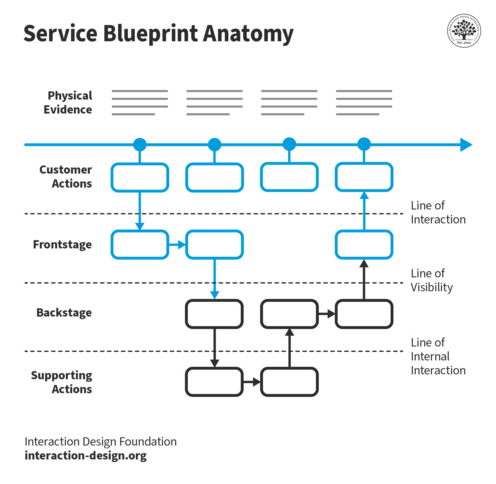

# Service Blueprint

## What Is It? 
A service is something that helps someone do something. It may be buying a home, requesting a refund, or catching a rideshare to the airport. **Service design** is about intentionally planning and organizing all parts of a service-what the user experiences and what happens behind the scenes-to make it smooth, effective, and valuable.

**Service Blueprinting** is a way to map out that service: it shows both the frontstage (what the user sees and does) and the backstage (the behind-the-scenes work and systems that make it possible). They are typically built collaboratively with folks that have an understanding of the user and organizational processes that result in service delivery.

© Interaction Design Foundation, CC BY-SA 4.0

## Why Do It? 
This activity helps teams uncover gaps, inefficiencies, and pain points in the service delivery process while also building shared understanding of each stage. By mapping the full ecosystem-what the user sees and what they don’t-it becomes easier to align teams, improve operations, and design better user experiences. Creating a shared map helps a team move faster toward shared understanding. Designers can use this tool to visualize points in service delivery where it’s critical for users to have control of the frontstage steps and when organizational processes should be hidden backstage.

## When To Do It?
Use service blueprinting when designing or improving services, especially those involving multiple teams, channels, or systems. Service blueprints should be used when documenting, diagnosing, or planning/proposing in the design process of a service. If you begin creating your blueprint during discovery, it can be used to help unlock the next level conversation as you move toward delivery and improving the service. A service blueprint is most easily created originating from a user journey map. A journey map details customer actions, the service blueprint begins to layer in other actions which aren’t visible to the end user.

## Who To Involve?
The full balanced team (Product Manager, Designer, Engineers), Customer Support or Operations, Subject Matter Experts (SMEs), Researchers, Stakeholders with insight into policies or systems. It is important to make sure you have *the right people* in the room. It may be preferable to bring in SMEs at separate times rather than have everyone participate at the same time.

## Tools You Might Need
**In Person**: Whiteboard/butcher paper, stickies, markers, print outs of personas or existing process maps  
**Digital**: Whiteboard tool such as FigJam, Miro, etc, digitized artifacts showing existing process maps or personas

## Time to Run This Play
90 Minutes \- 150 Minutes (can be broken into multiple sessions if needed) for the actual workshop. Async time to digitize and clean up the map.

## How To Do It (Steps)
1. **Start with a user scenario**  
   Pick a high-priority or common scenario from a persona or journey map. This anchors the blueprint in a real use case. Determine an agreed upon “zoom-level” for the questions you need to answer with the activity. The fidelity of the artifact should match the fidelity of the conversation blueprinting is meant to enable.
2. **Define the swimlanes**  
   Set up horizontal rows for:
      * User Actions
      * Frontstage (customer-facing interactions: UI, emails, phone calls)
      * Backstage (internal actions not visible to the user)
      * Support Processes (e.g., databases, 3rd-party systems)
      * Physical Evidence (emails, receipts, screens)
3. **Walk through the journey**  
   Have the team collaboratively walk through the steps the user takes, and for each:
      * Add what happens frontstage (visible to the user)
      * Then backstage (internal team/system actions)
      * Note the systems or tools involved
      * Add artifacts or physical evidence if applicable
4. **Identify pain points and gaps**  
   Look for disconnects: delays, unclear ownership, missing tools, or inconsistencies across channels. Mark these with different colors or annotations.
5. **Capture improvement ideas**  
   As issues emerge, encourage the team to jot down improvement ideas. You can cluster these later into themes or opportunities.
6. **Validate and evolve**  
   Review the blueprint with cross-functional partners or leadership. As services evolve, revisit and update the blueprint regularly.

## Example: Rideshare Service
Consider using an application on your phone to get a rideshare to the airport.

The end-user opens an application and types in a travel destination. This kicks off backstage actions to understand which drivers are in the area, determine the price for different services based on factors such as distance, driver availability, traffic, desired car size, and estimated time of arrival. Information is then presented back to the user (frontstage) so they can make a choice around which price point, level of service, and arrival time works best for their circumstances. After making that selection, additional backstage actions are kicked off to begin a matching process that matches a good fit driver to the rider’s needs. Drivers are able to decide whether they take a job or not. Once a match is found, information about the driver’s name, car, license plate, time of arrival are shown as frontstage actions back to the user so they can find their ride.

You can find an [example of an Uber service blueprint on the bottom of the page here](https://servicedesigntools.org/tools/service-blueprint).

## Relevant Links
* [NN/g Service Blueprints Definition](https://www.nngroup.com/articles/service-blueprints-definition/)
* [This is Service Design Doing \- Methods](https://www.thisisservicedesigndoing.com/methods)
* [Interaction Design Foundation: Service Blueprinting](https://www.interaction-design.org/literature/topics/service-blueprint?srsltid=AfmBOop-VjPJcGLziG-y3vy6Lck6BOKyG397v3p4nkMGd7GhXbgcNJ40)
* [Adaptive Path Guide to Service Blueprinting](https://maeda.pm/wp-content/uploads/2019/12/A-Guide-to-Service-Blueprinting.pdf)
