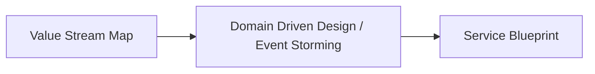

# 🧭 Value Stream Mapping (VSM) Play  
*A Strategic Guide for Grasping Current State and Accelerating Mission Impact*

---

## 📖 What is Value Stream Mapping?

Value Stream Mapping (VSM) is a Lean tool used to visualize the flow of work, materials, and information needed to deliver value to a customer—from request to delivery. In software delivery, this means mapping everything from a user need to production deployment.

At Rise8, we use VSM to reveal how value flows through our system, highlight inefficiencies, and align teams around transformation priorities.

### 🔍 Why is it Valuable?

- **Exposes waste**: Bottlenecks, delays, overprocessing, unused talent, excessive handoffs.
- **Aligns stakeholders**: Shared visibility across silos.
- **Guides improvement**: Enables smarter goal-setting and change management.
- **Builds systems thinking**: Understand interdependencies and optimize holistically.
- **Drives mission impact**: Every step in the stream must contribute to real-world outcomes.

> "VSM gives us the lens to diagnose noise in delivery and rewire teams for continuous value flow."  
> — *Adapted from Karen Martin & Mike Osterling*

---

## 🔄 Where VSM Fits in Our Continuous Improvement Framework

Value Stream Mapping is the **starting point** for understanding the current condition within the Improvement Kata framework:

1. **Understand the direction or challenge**  
   _What mission impact are we trying to enable?_
2. **Grasp the current condition**  
   _Use VSM to visualize the actual flow of value._
3. **Establish the next target condition**  
   _Set SMART goals based on constraints or opportunities identified._
4. **Experiment your way forward**  
   _Use this insight to conduct safe-to-fail experiments._

📌 *If you don’t know how value is flowing, or what’s constraining it—start with a VSM.*

---

## 🧭 VSM in the Order of Operations

The order of our modeling tools is intentional:

- **VSM** defines the *what* (business events, mission impact, and flow).
- **DDD/Event Storming** defines the *how* (bounded contexts, actors, and system behavior).
- **Service Blueprint** defines the *who and where* (front-stage/back-stage roles and tools).

Without a Value Stream Map, the rest is fiction.

---

## 🛠️ How to Facilitate a Value Stream Mapping Exercise

### ✅ Pre-Work Checklist

| Item | Why It’s Needed |
|------|-----------------|
| Clear mission objective | Guides what to optimize |
| Cross-functional participants | Ensures holistic view |
| Physical or virtual wall space | Allows collaborative mapping |
| Sticky notes or Miro board | Visual collaboration |
| Facilitation plan | Keeps session on track |
| Stopwatch or timer | Time measurements if needed |

---

### 🧩 Key Components to Map

| Component | Description |
|----------|-------------|
| **Trigger** | What kicks off the process? (e.g. customer request) |
| **Steps** | All discrete activities in value delivery |
| **Actors** | Who performs each step? |
| **Tools** | Systems or artifacts used |
| **Time** | Duration, wait time, cycle time |
| **Handoffs** | Between people, systems, departments |
| **Pain Points** | Bottlenecks, delays, rework, rejections |

---

### 🧭 Facilitation Tips

- **Use “Go See” mentality** – Encourage participants to describe what *really* happens, not what *should* happen.
- **Timebox mapping per stream** – e.g., 60–90 minutes for mapping, 30 minutes for analysis.
- **Ask probing questions**:
  - “What causes delays here?”
  - “Where do handoffs break down?”
  - “Where do you wait on feedback?”
- **Avoid mapping wishful thinking** – It’s about the current state, not the ideal.

---

### ⚠️ What to Avoid

- ❌ Mapping systems or roles instead of flows
- ❌ Rushing straight to solutions
- ❌ Over-scoping the stream (keep it narrow and meaningful)
- ❌ Failing to include voices from the edges (e.g., QA, Ops, Compliance)

---

## 🎯 What Comes After a VSM?

Now that you have a Value Stream Map, it’s time to **act on it**:

### 🔄 Play Recommendations

| Next Play | Why It Follows VSM |
|-----------|--------------------|
| **Improvement Kata** | Identify target condition & test changes to unblock value |
| **Event Storming / Domain Modeling** | Model the supporting systems and bounded contexts |
| **Service Blueprint** | Define user experience & operational architecture |
| **Impact Mapping** | Clarify initiative scope by tying improvements to behavior & mission outcomes |
| **Outcome-Oriented Roadmapping** | Prioritize work that shortens time-to-impact in the stream |

---

## 📚 References & Learning Resources

- **Book**: *Value Stream Mapping* by Karen Martin & Mike Osterling – Essential for understanding the lean and facilitation discipline behind VSM.
- **eBook**: [4 Easy Steps to Mastering Chaos with VSM](https://enterprise-software.broadcom.com/valueops-connectall-insights) – Useful to contextualize modern software VSM.
- **Concept**: *Improvement Kata* – Learn to iterate toward outcomes: [Toyota Kata](https://www.toyotakata.org/)

---

## ✨ Final Thought

> “Until you make the invisible visible, you cannot improve it.”  
> — *W. Edwards Deming*

Value Stream Mapping isn’t just a workshop—it’s a lens. Use it to decode your current state, align your team, and unlock the flow of mission impact.
