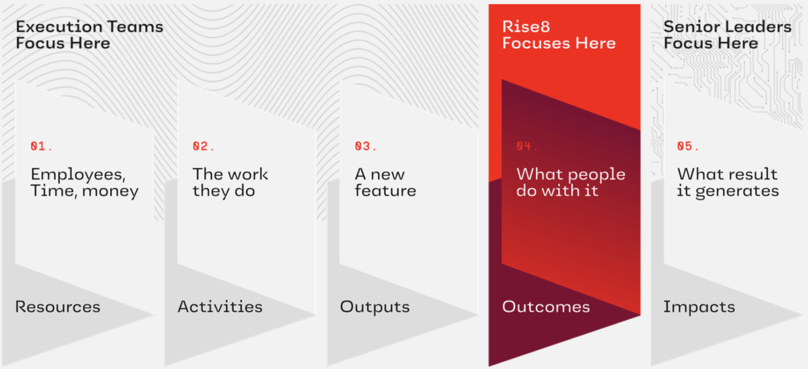
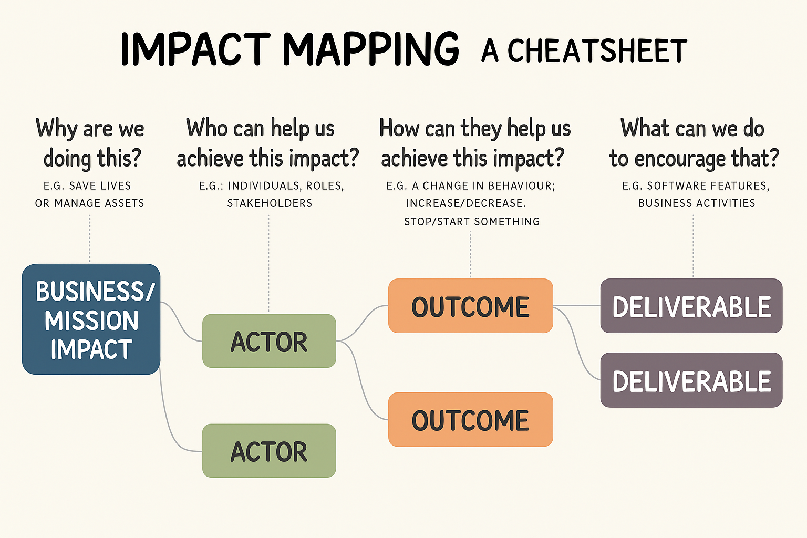

# Impact Mapping

## What is Impact Mapping?
Impact Mapping is a strategic planning and alignment technique designed to help teams visualize the cause-and-effect relationship between the outcomes they aim to achieve and the deliverables they plan to build. It creates a shared understanding among cross-functional teams about what will drive meaningful mission or business impact.

At Rise8, we use Impact Mapping to:

- Align work with measurable **Business/Mission Impact**
- Facilitate strategic conversations with stakeholders
- Prioritize deliverables that create real change
- Avoid building outputs that don't serve user or mission needs

While you may find a different standard format for Impact Mapping tools outside of Rise8, we have modified the four key dimensions to match how we speak about ***outcomes in prod*** which was borrowed from Josh Seiden's framing of Outcomes over Outputs:

- **Business / Mission Impact** (what we want to measurably change for our customer/organization; formerly “Goal”)
- **Actors** (who can influence outcomes)
- **Outcomes** (system or user behaviors we want to change; formerly "Impact")
- **Deliverables** (what we might build)

 

## Why It's Valuable
Impact Mapping helps teams avoid the **feature factory trap** by focusing on what needs to change, for whom, and why. It's a natural complement to:

- [**Value Stream Mapping**](../product/value-stream-mapping.md), which confirms how value currently flows (or doesn’t), and how to measure it
- **OKRs**, which define the measurable company or business level goals we’re aiming for
- **[Event Storming](https://labspractices.com/practices/event-storming/), [Boris](https://labspractices.com/practices/boris/), and [Swift Method](https://www.youtube.com/watch?v=7-fRtd8LUwA)**, which models domain events and interactions

When used correctly, Impact Maps:

- Uncover hidden assumptions
- Clarify intent before jumping to solutions
- Strengthen outcome-first thinking
- Improve stakeholder alignment

 

## Related Frameworks: When and Why to Use Each
| Framework | What it is | Compared to Impact Mapping |
|----------|-------|-------------|
| **Opportunity Solution Tree (OST)** | OST starts with an Outcome - meaning a change in behavior that is, for example, derived from a team level key-result. | An Impact Map looks for a company-wide health indicator (Impact) as the primary anchor, starting with a company or business level OKR. |
| **OKRs** | The Key Results of a more tactical OKR set typically express a specific change in behavior, aka Outcome. | Theres a strong correlation between the HOW level of an Impact Map and the Key Results of a team. Discovery work leads to validated Outcomes (documented in an Impact Map). |
| **North Star Framework** | Product strategy and leading indicator alignment with a single North Star Metric and supporting inputs. | Impact Mapping helps explore questions about the Who, How, and What. |
| **JTBD** | Understanding and predicting motivations and context related to Consumers' Jobs (their unmet goals and constraints), and a common language for demand, opportunity and growth. | Helps teams ensure that everyone remains in alignment and focus throughout their discovery efforts. |

 

## Prerequisite: Have a Clear Impact Target
Before running an Impact Mapping exercise:

- Confirm that your team has a clearly defined and **quantified Business/Mission Impact and current state Outcome** targets 
- Without these, you risk generating a list of disconnected activities with no clear prioritization logic, or way of determining success as you run experiments

If you don’t have these yet:

- Start with [Value Stream Mapping](../product/value-stream-mapping.md), [Event Storming](https://labspractices.com/practices/event-storming/), [Boris](https://labspractices.com/practices/boris/), [Swift Method](https://www.youtube.com/watch?v=7-fRtd8LUwA) and [Service Blueprint](../design/service-blueprint.md) exercises to clarify impact and outcome opportunities
- Use those outputs to anchor your Impact Map

 

## How to Facilitate an Impact Mapping Session

### Prep Checklist
| Item | Description |
|------|-------------|
| Canvas | Apply Rise8’s custom layout: **Impact → Actors → Outcomes → Deliverables** |
| Facilitator | One lead facilitator to guide the session and prompt critical thinking |
| Participants | Balanced team members (Product, Design, Engineering) + Key stakeholders |
| Context Brief | Background material on problem space, relevant data, and mission objectives |
| Timer | To time-box each mapping phase and ensure momentum |
| Whiteboarding Tool | Miro, Mural, Figjam, or physical whiteboard with sticky notes |

### Facilitation Steps
| Step | Actions to take |
|------|-----------------|
| **1. Frame the Mission Impact** | - Revisit the VSM or OKR related quantified impact you’re targeting - Write this at the top of the canvas under **Business / Mission Impact** - Ensure shared clarity across all participants |
| **2. Identify Actors** | - Who can enable or block this impact? - Consider internal roles, external users, partners, and regulators - Capture each actor in the second column |
| **3. Define Behavioral Outcomes** | - For each actor, what specific behavior must change? - Use the format: _"We need [actor] to [do something measurably differently]" - Focus on behavior, not sentiment |
| **4. Brainstorm Potential Deliverables** | - What could we build to influence these behaviors? - List multiple options per outcome — don’t filter too early - Use this moment to provoke critical conversations ("Will this actually cause the behavior change?") |
| **5. Cluster and Prioritize** | - Group deliverables that support the same outcome - Assess risk vs impact to focus efforts - Use dot voting or effort-impact 2x2 prioritization if needed |

### Tips for Better Output

- Encourage divergent thinking early, then converge later
- Keep the language behavioral and concrete
- Use data or anecdotes to challenge assumptions
- Ask "If we build this, why do we believe it will cause that outcome?"

### Common Pitfalls to Avoid
| Pitfall | How to Avoid It |
|--------|------------------|
| Jumping straight to, and working backwards from, deliverables | Force conversation to stay in Outcomes layer until well-explored |
| Vague impact statements | Quantify impact — don’t settle for "improve UX" or "streamline workflow" |
| Overloading the map | Limit deliverables to high-impact hypotheses, not every possible idea |
| Groupthink | Actively invite dissenting views to expose blind spots |

 

## After the Session: What’s Next?

- Synthesize the output into a cleaned-up map
- Highlight any assumptions or validation needs
- Connect prioritized Impact, Outcomes and Deliverables to your [Outcome-Oriented Roadmap](https://delivery-playbooks.rise8.us/content/practices/outcome-oriented-roadmaps/)
- Use the map in stakeholder conversations to justify choices

 

## Relavant Links & Resources

- [ImpactMapping.org](https://www.impactmapping.org/)
- Book: [Impact Mapping: Making a Big Impact with Software Products and Projects](https://www.amazon.com/Impact-Mapping-Software-Products-Projects/dp/0955683645)
- Book: [Outcomes Over Output: Why customer behavior is the key metric for business success](https://www.amazon.com/Outcomes-Over-Output-customer-behavior/dp/1091173265)
- YouTube: [Imapct Mapping & Story Mapping](https://youtu.be/yQzIfKzU9PI?feature=shared&t=240)
- Slides: [Impact Maps & Story Maps - Delivering what really matters](https://www.slideshare.net/slideshow/2014-0618srdimpact-mapsstorymapsen/36019733)

