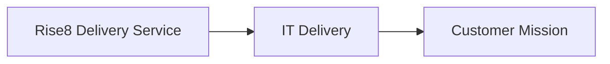
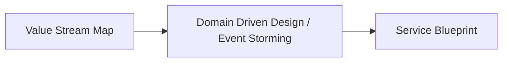

# Value Stream Mapping (VSM) Play  
*A Strategic Guide for Grasping Current State and Accelerating Mission Impact*

---

## What is Value Stream Mapping?

Value Stream Mapping (VSM) is a Lean tool used to visualize the flow of work, materials, and information needed to deliver value to a customer—from request to delivery. In software delivery, this means mapping everything from a user need to production deployment.

At Rise8, we use VSM in relation to Theories of Constraints to reveal how value flows through our system, highlight inefficiencies, and align teams around transformation priorities.

- **Every system has a constraint:** This is the factor that most restricts the system's output.
- **Improving the constraint improves the system:** Focusing efforts on the constraint yields the most significant performance enhancements.
- **Continuous improvement:** Once a constraint is resolved, another will emerge, necessitating ongoing attention and refinement.

### Why is it Valuable?

- **Exposes waste**: Bottlenecks, delays, overprocessing, unused talent, excessive handoffs.
- **Aligns stakeholders**: Shared visibility across silos.
- **Guides improvement**: Enables smarter goal-setting and change management.
- **Builds systems thinking**: Understand interdependencies and optimize holistically.
- **Drives mission impact**: Every step in the stream must contribute to real-world outcomes.

> *"VSM gives us the lens to diagnose noise in delivery and rewire teams for continuous value flow."*

 

## Three Value Streams to Remember

Regardless of your role at Rise8, it's important to understand the three Value Streams that we influence, and their differences:

1. **Customer Mission**: Represents personnel, capabilities and outcomes in production that impact real mission operations (eg. running Air Operations Center missions such as Intelligence, Surveillance, and Reconnaisssance) 
2. **IT Delivery**: Enables the delivery of mission capabilities, measured up through deployment into a production environment (eg. enabling continuous delivery).
3. **Rise8 Delivery Service**: How we partner with customers to bridge the gap between output and impact by identifying opportunities for deploying elite software development for mission critical outcomes in production (eg. deliver cloud & platform, apps & digital products as well as cybersecurity & RMF).

 

## Where VSM Fits in Our Continuous Improvement Framework

Value Stream Mapping is the **starting point** for understanding the current condition within the Improvement Kata framework:

1. **Understand the direction or challenge**  
   _What mission impact are we trying to enable?_
2. **Grasp the current condition**  
   _Use VSM to visualize the actual flow of value._
3. **Establish the next target condition**  
   _Set SMART goals based on constraints or opportunities identified._
4. **Experiment your way forward**  
   _Use this insight to conduct safe-to-fail experiments._

> *If you don’t know what value you're trying to achieve, how value is flowing, or what’s constraining it—start with a VSM.*

 

## Order of Context Modeling Tools is Intentional

- **VSM** defines the *what and why* (business events, mission impact, and flow).
- **DDD/Event Storming** defines the *how* (bounded contexts, actors, and system behavior).
- **Service Blueprint** defines the *who and where* (front-stage/back-stage roles and tools).

> *Without a Value Stream Map, the rest is fiction.*

 

## How to Facilitate a Value Stream Mapping Exercise

### Pre-Work Checklist

| Item | Why It’s Needed |
|------|-----------------|
| Clear mission objective | Guides what to optimize |
| Cross-functional participants | Ensures holistic view |
| Physical or virtual wall space | Allows collaborative mapping |
| Sticky notes or Miro board | Visual collaboration |
| Facilitation plan | Keeps session on track |
| Stopwatch or timer | Time measurements if needed |

---

### Key Components to Map

| Component | Description |
|----------|-------------|
| **Trigger** | What kicks off the process? (e.g. customer request) |
| **Steps** | All discrete activities in value delivery |
| **Actors** | Who performs each step? |
| **Tools** | Systems or artifacts used |
| **Time** | Duration, wait time, cycle time |
| **Handoffs** | Between people, systems, departments |
| **Pain Points** | Bottlenecks, delays, rework, rejections |

---

### Facilitation Tips

- **Apply a “Go See and Find Out” mentality** – Encourage participants to describe what *really* happens, not what *should* happen.
- **Timebox mapping per stream** – e.g., conduct iterations of 60–90 minutes for mapping, 30 minutes for analysis, until you have enough clarity to make measurable decisions.
- **Ask probing questions**:
  - “What causes delays here?”
  - “Where do handoffs break down?”
  - “Where do you wait on feedback?”
  - “Where do we often repeat steps/work?”
- **Avoid mapping wishful thinking** – It’s about the current state, not the ideal (this is more of a focus for Service Blueprint artifacts).

---

### What to Avoid

- Mapping systems or roles instead of flows
- Rushing straight to solutions
- Over-scoping the stream (keep it narrow and meaningful)
- Failing to include voices from the edges (e.g., QA, Ops, Compliance)
- Over-scoping the stream (keep it narrow and meaningful)

---

## Facilitation Script & Prescriptive Steps for Building a VSM

Use the following script and facilitation steps to confidently lead a Value Stream Mapping session. This structured approach ensures the session yields a high-quality map and actionable insights.

### Before the Session

1. **Define the scope and objective**  
   _"We’re here to understand how value flows today—so we can unblock it and drive greater mission impact."_

2. **Identify the right participants**  
   Include frontline workers, key process owners, system leads, and stakeholders.

3. **Prepare the collaboration space**  
   Whether virtual or physical, have clear lanes for steps, time, pain points, actors, and tools.

4. **Send pre-read materials**  
   Share what a VSM is, why it matters, and the session goals.

---

### During the Session

#### Opening Script (5 mins)
> _"Thanks for joining. Today we’re mapping our value stream to uncover where work gets stuck, who’s involved, and how it flows—or doesn’t flow—across systems and teams. This helps us deliver outcomes faster and with less pain. Our focus is on the **current state**, not what we wish it looked like."_

#### Step-by-Step Facilitation

1. **Establish the mission outcome**
   - _"What’s the core mission this stream supports?"_
   - E.g., “Deliver approved benefits to veterans”

2. **Identify the triggering event**
   - _"What starts the process?"_ (e.g., “Veteran submits claim”)

3. **Map major process steps**
   - Use stickies or virtual cards.
   - Ask: _“What happens next?”_ after each step.

4. **Add actors to each step**
   - _"Who does this work?"_

5. **Identify tools/systems used**
   - _"What tools support this step?"_

6. **Estimate durations and wait times**
   - _"How long does this take?"_, _"How long does it wait?"_

7. **Mark handoffs and dependencies**
   - Use arrows to denote transitions or approvals.

8. **Capture pain points**
   - Ask: _"Where do things break down?"_, _"What causes delay or rework?"_

9. **Highlight visible and invisible work**
   - Surface shadow systems, workaround steps, manual interventions.

10. **Review the full map**
    - Ask: _"What surprises you?"_, _"Where do we lose the most time or value?"_

---

### After the Session

1. **Document and digitize the map**
   - Use Miro, Lucidchart, or Mural to clean up and archive.

2. **Synthesize insights**
   - Highlight biggest bottlenecks, gaps, or silos.

3. **Debrief with participants**
   - Share early takeaways and thank them for candor.

4. **Link to Improvement Kata**
   - Define the next target condition using the VSM output.

5. **Decide next play**
   - DDD? Service Blueprint? Outcome Roadmap? Start where the pain is highest.

> _“The goal isn’t just the map—it’s momentum. Use your VSM to drive the next best improvement toward better mission outcomes.”_

 

## What Comes After a VSM?

Now that you have a Value Stream Map, it’s time to **act on it**:

### Play Recommendations

| Next Play's to Consider | Why It Follows VSM |
|-----------|--------------------|
| **Improvement Kata** | Confirm current and target conditions & prioritize changes to test how you could unblock value |
| **Event Storming / Domain Modeling** | Model the supporting systems and bounded contexts |
| **Service Blueprint** | Define user experience & operational architecture |
| **Impact Mapping** | Clarify initiative scope by tying improvements to outcomes in prod with measurable user/system behavior changes & mission impact |
| **Outcome-Oriented Roadmapping** | Communicate and align your team and stakeholders to what gets worked now, next and later to address our value stream current conditions |

---

## Relevant Links & Resources

- **Book**: *Value Stream Mapping* by Karen Martin & Mike Osterling – Essential for understanding the lean and facilitation discipline behind VSM.
- **eBook**: [4 Easy Steps to Mastering Chaos with VSM](https://enterprise-software.broadcom.com/valueops-connectall-insights) – Useful to contextualize modern software VSM.
- **Concept**: *Improvement Kata* – Learn to iterate toward outcomes: [Toyota Kata](https://www.toyotakata.org/)

 

## Final Thought

> “Until you make the invisible visible, you cannot improve it.”  
> — *W. Edwards Deming*

Value Stream Mapping isn’t just a workshop—it’s a lens. Use it to decode your current state, align your team, and unlock the flow of mission impact.
