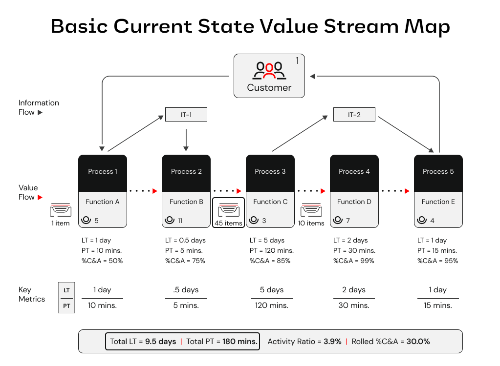
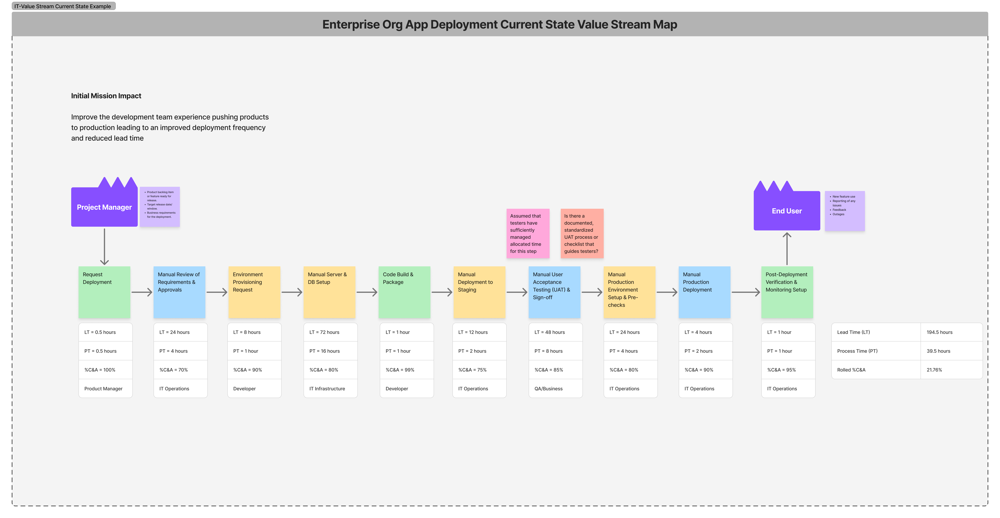

# Value Stream Mapping (VSM)
*A Strategic Guide for Grasping Current State and Accelerating Mission Impact*

---

## What is Value Stream Mapping?

Value Stream Mapping (VSM) is a Lean tool used to visualize the flow of how value is delivered to a customer—from request to fulfillment. Whether we're talking about software delivery, medication prescriptions, or launching rockets into orbit, this means mapping all of the activities required to transform a customer request into a good or service being fulfilled.

At Rise8, we use VSM in relation to Theories of Constraints to help identify and remove constraints that limit throughput, and thus increasing value stream capacity and qualtiy. By revealing how value flows through our system, highlighting inefficiencies, and aligning teams around transformation priorities, we create imbalances to maximize throughput at the constraint. 

- **Every system has a constraint:** This is the factor that most restricts the system's output.
- **Constraints set the pace:** Draw focus to the constraint until it is no longer the constraint
- **Improving the constraint improves the system:** Focusing efforts on the constraint yields the most significant performance enhancements.
- **Continuous improvement:** Once a constraint is resolved, another will emerge, necessitating ongoing attention and refinement.

### Why is Value Stream Mapping valuable?

To visualize and improve our process of delivering greater value to customers, we follow seven key principles for Value Stream Mapping:

1. **Customer-Centric Focus:** VSM should always begin with the customer in mind. Understanding what the customer values ensures that the mapping process aligns with delivering that value efficiently.
2. **Holistic Systems Thinking:** Rather than optimizing individual processes (i.e. individual "component" efficiency), VSM emphasizes viewing the entire value stream to identify and eliminate waste, ensuring systematic improvements and efficiency (e.g. if one rower suddenly changed their stroke rate, they'd immediately cause the boat to change direction and potentially lose the race).
3. **Leadership Engagement:** Effective VSM requires the involvement of stakeholders who have the authority and vision to implement significant changes. Their engagement ensures that improvements are strategic and aligned with mission objectives.
4. **Distinction Between Core and Supportive Value Streams:** Both core value streams (directly delivering products or services) and supportive value streams (such as employee onboarding or software delivery) are crucial for overall organizational performance.
5. **Data-Driven Analysis:** VSM relies on collecting accurate data for process times, lead times, and other metrics that are relevant to your mission/business process to identify bottlenecks and areas for improvement.
6. **Visualization for Clarity:** Creating visual maps of processes helps teams understand current workflows, identify inefficiencies, and design improved future states.
7. **Iterative Improvement:** VSM is not a one-time activity. Organizations should regularly revisit and update their value stream maps to reflect changes and continue improving.

> **It's not about the map.** *It's about the conversations, insights, decisions, and organizational healing that mapping enables for continuous value flow.*

 

#### The difference between Value Stream vs. Process Map perspectives

Value stream perspectives should focus on the macro view of the system. This is where we are thinking about strategic "what" and "why" conversations with leaderhip based on the organizations context. They're typically broader in scope, involve cross-functional handoffs, and have longer lead times. Some examples coule be:

- A complex overview of highway system that supports continuous flow of traffic
- Delivering a car to a customer
- Staffing an employee to work on a contract

Whereas process mapping perspectives help us see the micro level details. This is where we focus on the tactical "how" conversations.

- A state highway patrol officer responsible for radaring traffic on a designated section of I-90
- How exteroir car parts are painted
- Writing and posting a job req on external websites

### How do we categorize waste?

The following categories of waste are used by nearly all communities. We've provided some Software Delivery and Healthcare examples to help translate these for different context settings.

| Waste Category                                                                     | Software Delivery Example                                              | Healthcare Example                                                      |
|------------------------------------------------------------------------------------|------------------------------------------------------------------------|-------------------------------------------------------------------------|
| **Defects:** products or services requiring rework due to errors or non-conformity | Bugs in production causing hotfixes or patches                         | Misdiagnoses or medication errors requiring correction                  |
| **Overproduction:** making more than required or before needed                     | Developing extra features that go unused by end-users                  | Conducting unnecessary diagnostic tests or preparing surplus supplies   |
| **Overprocessing:** doing more work than the customer needs or expects             | Extra documentation or rework due to unclear requirements              | Duplicate paperwork or redundant procedural steps                       |
| **Waiting:** idle time when processes or people wait for the next step             | Delays waiting for code reviews, QA, or deployment approvals           | Patients waiting for test results, physician availability, or beds      |
| **Inventory:** excess materials or work-in-progress not yet adding value           | Backlog of unfinished code or features (WIP)                           | Stockpiling supplies or medications that risk expiration                |
| **Transportation:** unnecessary movement of materials or information               | Excessive handoffs between teams or environments                       | Moving patients between departments more than needed                    |
| **Motion:** unnecessary movement by people or equipment                            | Frequent context switching between tasks                               | Staff walking long distances to fetch equipment or records              |
| **Unused Talent:** under-utilizing employees’ skills, creativity, or knowledge     | Developers limited by bureaucracy and not tapped for improvement ideas | Staff ideas or advanced skills not leveraged for process improvements   |

 

### When to introduce new process blocks

As teams are discussing and laying out process blocks along their current value stream, there is always a question of how macro to go, and this takes some practice. You want to make sure that your value stream map isn’t so large that it becomes unwieldy, nor so simple that it becomes useless. To aid in targeting the right level of information, we aim for 5 to 15 serial process blocks. If we have fewer than 5 process blocks, we may not have enough details to make meaningful or effective decisions. If we have more than 15 process blocks, it could mean our scope is too broad, or we could be slipping into Process Mapping territory with micro level details. Neither should cause us to immediately jump to the conclusion that a VSM would not be valuable. It just means we need to recalibrate and make sure we make a concious decision to proceed as is, or make an adjustment. This often prompts the question, "how do we know when to add a new process block vs. combine them?". Remember, value flow is present when work moves from one process to the next in the value stream without interruption or delay. Generally, ***a new process block is warranted when the work stops flowing***. This often 
occurs when there is a break in the timeline or flow:

- a **handoff to a new work area**
- **work accumulates** - a buildup of work-in-process
- the **work is only processed at a predetermined time interval** - batching

### Parallel vs branching process blocks

At times we may need to articulate scenarios where our value stream splits into multiple processes. For example, You may find that the output from one process block is passed to two or more functions and is worked on concurrently. We call these ***parallel processes***, and facilitators should stack these process blocks above one another in the same vertical plane as shown by the example below and notated with a 2a and 2b, as well as 3a and 3b, respectively. 

In other cases, we may need to distinguish that work is proceeding to different downstream processes based on specified segmentation criteria (e.g. depending on the software change complexity or urgency, we may trigger a slightly different process block). The figure below highlights an example where process blocks 3 and 4 are branching, but they are not parallel processes.

    

### What metrics are commonly used in VSM?

VSM metrics can span categories like time, flow, quality, cost, people, or any metric that is relevant to your mission context

| Metric Category             | Metric Name                                | Description                                                                                          | Software Delivery Example (Results)                       | Healthcare Example (Results)                                   |
|-----------------------------|--------------------------------------------|------------------------------------------------------------------------------------------------------|------------------------------------------------------------|----------------------------------------------------------------|
| **Time, Flow & Efficiency** | Lead Time (LT)                             | Time to complete an individual process block, as well as total time from order to delivery—reflects responsiveness of the process.                                | 5 days from ticket submission to production deploy         | 35 minutes from prescription request to fulfillment      |
|                             | Process Time (PT)                          | Time it takes between when the work arrives at a process block until it’s passed on to the next step, as well as total time spent executing all process blocks (touch time).                                                   | 4 hours—actual coding, testing, and merging time per feature | 4 minutes—actual work in filling prescription          |
|                             | Throughput                                 | Rate at which units are delivered over time.                                                         | 3 features released per sprint                            | 20 prescriptions filled per hour                               |
|                             | Utilization                                | Percentage of time resources are in active use.                                                  | Developers active ~80% of day                             | Nurses spend ~70% shift on value-added patient tasks           |
|                             | Flow Efficiency                            | Ratio of processing time vs total lead time.                                                         | (4h PT ÷ 5 days LT) ≈ 3%                                  | (4 min PT ÷ 35 min LT) ≈ 11%                      |
| **Quality**                 | Defect Rate                                | Number or percentage of defect occurrences.                                                      | 10% bug rate found post-release                           | 2% medication dispensed incorrectly                            |
|                             | First Pass Yield                           | Share of units completed accurately without rework.                                                 | 85% of deployments succeed without hotfix                 | 90% of patient charts correct on first review                  |
|                             | Quality Filter Mapping                     | Percent of defects detected at each stage (e.g., dev, QA).                                          | Dev: 5%, QA: 3%, Prod: 2%                                 | Registration errors: 4%; Diagnostic errors: 6%                 |
|                             | % Complete & Accurate (%C&A)               | Share of work handed downstream with no issues.                                                     | 95% of code reviews pass without rework                   | 92% of patient charts are complete and accurate                |
|                             | Rolled %C&A                                | Overall downstream-ready rate across all steps (product of stepwise %C&A).                          | 0.95 × 0.90 × 0.92 ≈ 79% overall yield                    | 0.92 × 0.95 × 0.90 ≈ 79% across admission, assessment, care     |
|                             | Simple Avg %C&A                            | Unweighted average of %C&A across steps.                                                             | (95% + 90% + 92%) ÷ 3 ≈ 92.3%                             | (92% + 95% + 90%) ÷ 3 ≈ 92.3%                                 |
|                             | Weighted Avg %C&A                          | Average of %C&A weighted by volume at each step.                                                    | (95% × 50 + 90% × 30 + 92% × 20) ÷ 100 ≈ 92.1%            | (92% × 40 + 95% × 40 + 90% × 20) ÷ 100 ≈ 92.4%                 |
| **Cost**                    | Inventory Cost                             | Cost associated with holding WIP or stock.                                                          | $5,000 in backlog work-in-progress                       | $1,200 of unused medications in stock                        |
|                             | Waste Cost                                 | Estimated cost of inefficiencies or defects in the stream.                                          | $3,000 per sprint from bug-fix rework                    | $500 per week from patient flow delays                         |
| **Customer/Delivery**       | On-Time Delivery (%)                       | Percentage of units delivered by promised deadlines.                                                | 95% of features released on planned date                  | 90% of patients receive meds on schedule                       |
|                             | Customer Satisfaction                      | User-rated satisfaction.                                                                            | 4.5/5 from product surveys                                | 4.3/5 from patient feedback surveys                           |
| **Bottleneck Analysis**     | Relative Bottleneck Frequency              | How often a particular stage becomes a bottleneck.                                                     | Code reviews are bottleneck 60% of the time               | Lab results delay bottlenecks in 40% of patient flows         |
|                             | Relative Bottleneck Severity               | Degree of impact when a stage becomes a bottleneck.                                                            | Delays lead to +2 days release delay                     | Adds +30 min to patient wait time                             |
| **Mission**                 | One Mission Metric That Matters (OMMTM)    | The north star guiding metric, and any other critical KPIs that are relevant to the mission we're serving.                                            | Deployment Frequency (target on-demand) Lead Time for Changes (target less than one day) Change Failure Rate (target < 15%)        | Eliminate annual deaths caused by treatment failures (target = 0) |

 

### Key metrics

#### Lead Time & Processing Time

Lead time (aka Elapsed Time, Throughput Time, or Turnaround Time) accounts for all time between work received and work passed to the next process block - including the processing time. Process time (aka Touch Time, Work Time, or Cycle Time) is measured whenever work is not sitting idle. Another way to think about process time is when we're touching, talking or thinking about the work.

#### Percent Complete & Accurate (%C&A)

When calculating %C&A, we're trying to understand the quality of both inputs and outputs throughout our value stream. It's important to note that %C&A of one mission/business process block is calculated based upon the feedback from the downstream mission/business process block(s). If we take the 80% C&A designation for Process block #1 as an example, what this actually communicates is that only 80% of the work that Process block #2 receives from Process block #1 is "usable as is". In other words, 20% of the time the owner of Process block #2 is having to take one or more of the following actions to be 100% C&A (i.e. zero quality issues; optimal flow)

1. **Correcting** infromation or material that was supplied
2. **Adding** information that should have been supplied
3. **Clarifying** informaiton that should/could have been clearer

 

##### Multiple downstream process owners receive work from one upstream process owner

When multiple downstream process owners are using the work provided by one upstream process owner, we want to reflect %C&A for the upstream process owner by combining the feedback from all of the applicable downstream process owners. 

- In the example below, process block owner #5 states that the %C&A should be 75%, while process block owner #7 says %C&A is 50%.
- So the overall %C&A for process block #4, who provided the work that process block #5 and #7 relied on, is actually 37.5%.

## Three value streams relevant to Rise8's business

Regardless of your role at Rise8, it's important to understand the three Value Streams that we influence, and how they support our company's value equation of optimizing for mission value:

1. **Customer Mission**: Represents personnel, capabilities and outcomes in production that impact real mission operations (e.g. running Air Operations Center missions such as Intelligence, Surveillance, and Reconnaisssance) 
2. **IT/Software Delivery**: Enables the delivery of mission capabilities, measured up through deployment into a production environment (e.g. enabling continuous delivery).
3. **Rise8 Delivery Service**: How we partner with customers from pre-sales to delivering outcoms in prod, we bridge the gap between output and mission impact through standard Rise8 services such as delivering cloud & platform solutions, misison-critical apps, as well as continuous software delivery capabilities).

## Basic current state VSM

A basic current state value stream map will highlight the following at a minimum:

- If there is a supplier and customer involved, or the customer plays both roles, for how value is generated.
- Information flow layer (e.g. IT systems or other products that help move data)
- Process flow layer (e.g. the high level mission/business process blocks that deliver value)
- Key metrics (i.e. Lead Time, Processing Time, and Rolled % Complete and Accurate)
- The number of processed units/items that are sitting or waiting in inventory or a queue between processes
- What function/department/group is responsible for completing the process block
- The number of operators/workers that are required for a process block to be completed (also indicates where a process block is not automated)

### Example and obvious waste signals

Below is an example of a basic current state VSM, and some obvious waste signals that should be addressed:

1. 45 items are being queued between process blocks 2 and 3
2. LT is nearly 10 days while PT is only 3 hours
3. IT systems 1 and 2 within the Information flow layer are not integrated throughout this value stream

 

 

> _“The goal isn’t just the map—it’s momentum. Use your VSM to drive the next best improvement toward better mission outcomes.”_

 

## How to facilitate a Value Stream Mapping exercise

Try out our Figjam template [VSM Resources](https://www.figma.com/board/h6EfV3nAOHoAR9JOa7UXF7/-CREATE-COPY----Rise8-Standard-Delivery-Artifacts?node-id=0-1&p=f&t=y3WJv70v7goBSbmo-0) to facilitate current and target state VSM workshops, or assist in digitizing outputs from a workshop leveraging sticky notes. 

### Pre-work checklist

| Item | Why It’s Needed |
|------|-----------------|
| Clear mission objective | Guides what to optimize |
| Cross-functional participants | Ensures holistic view |
| Physical or virtual wall space | Allows collaborative mapping |
| Sticky notes or [Figjam board](https://www.figma.com/board/h6EfV3nAOHoAR9JOa7UXF7/-CREATE-COPY----Rise8-Standard-Delivery-Artifacts?node-id=0-1&p=f&t=y3WJv70v7goBSbmo-0) | Visual collaboration |
| Facilitation plan | Keeps session on track |
| Stopwatch or timer | Timebox conversations or measuring time performance of process blocks within your VSM |

> *[Value Stream Mapping Supplemental Materials](https://tkmg.com/wp-content/files/VSM-Supplement.pdf) from Karen Martin & Mike Osterling.*

---

### Key components to map

| Component | Description |
|----------|-------------|
| **Mission Impact** | “What’s the core mission/business impact this value stream supports?” “How do we measure business/mission impact success today?” |
| **Trigger** | What kicks off the process? |
| **Supplier/Initiator** | Who starts the desired outcome of flow? |
| **Inputs** | What inputs are provided or required from initiators to drive our mission/business process? |
| **Customer/End-User** | Who receives our outputs, what do they do with it? |
| **Outputs** | What outputs do customers/end-users receive from our business/ mission process? |
| **Mission/Business Process Flow** | Confirm how value is delivered and classify process blocks as 'Value Added' 'Non-value Added' or 'Required Non-value Added' |
| **Information Flow** | Confirm what systems/applications are used in support of the mission/business process flow, and how they transmit or receive data |
| **Key Metrics** | Align on what we need to measure for our value stream. At a minimum we should always have Lead Time, Process Time and %C&A |
| **Handoffs** | Between people, systems, departments |
| **Pain Points** | Bottlenecks, delays, queues, rework, rejections |

---

### Workshop tips

💡 Ensure the right participants are invited to VSM workshops. Inviting the following personas will lead to better success:

- **Customer Leadership:** would be considered a leader of the government organization
- **Buyer:** responsible for making future contract decisions
- **Mission Owner:** represents the interests of the mission
- **Influencer:** someone who can advocate or dissuade leadership in the organization due to their experience or clout
- **User Community:** a leader, proxy, or member of the user base

💡 Start with your “Current State” value streams for the initial stream to be mapped. Encourage participants to describe what really happens.

💡 Focus on “Target State” once you have today’s streams mapped, and directionally measured.

💡 Agree on refresh triggers/cycles (we recommend fitting this into your hypothesis validation steps, before starting a new hypothesis experiment)

💡 Build the Current State VSM in three phases

1. Mission/Business process blocks & work in process
2. Information flow (i.e. applications, systems, and how information is transfered)
3. Key Metrics and timelines

💡 What to Avoid:

- Mapping discrete actor (systems or users) actions instead of flows
- Rushing straight to solutions
- Only soliciting contributions of a few people (only SMEs speaking)

---

### Facilitation tips

💡 **Apply a “Go See and Find Out” mentality** – Encourage participants to describe what *really* happens, not what *should* happen.

💡 **Time-box mapping per stream** – e.g., conduct iterations of 60–90 minutes for mapping, 30 minutes for analysis, until you have enough directional clarity to make informed decisions.

💡 **Ask probing questions** - 

- What mission impact are we trying to enable? What causes delays here?
- Where do handoffs break down?
- Where do you wait on feedback?
- Where do we often repeat steps/work?
- Where does work slow/stop/accumulate?
- Which process metrics point to a significant need?
- Where do we see pockets of greatest pain (anecdotally)?
- How effective is our information flow design?

💡 **Process blocks with repeating actors** – If process blocks start to repeat the same actor, this might be a sign we are process mapping at a micro level (especially if PT is reflected as a couple minutes or seconds). In this case, we need to  explore how we consolidate and elevate to a macro process block. The unique context of the situation should drive a decision to elevate or maintain the level we're capturing in the VSM.

💡 **Save wishful thinking for target state** – Ask participants to articulate a perfect target state using short phrases. 

- What are the problems or opportunities we wish we could address?
- What does our customer truly value?
- Touch points (reduce handoffs?)
- Delays (why? how to eliminate?)
- Sequencing & pacing (more in parallel?)
- Variation management (work segmentation?)
- Technology (supportive?)
- Quality (error-proofing needed?)
- Labor effort (reduce PT while improving safety & quality?)
- Value stream management (how? who?)

💡 There can be multiple initiators and customers; A VSM can start & end with our customer.

💡 While we tend to favor present tense / action verbs since VSMs are meant to visualize how work flows through a system, and not just document what has already occurred, we recommend matching the style to your organization’s standards (if they exist). For example, some healthcare or government teams prefer noun phrases or past tense for audit-readiness, while Lean product or software teams almost always stick with present-tense verbs.

💡 Steps should be high-level enough to demonstrate the overall process flow, but specific enough to be able to identify waste, hand-offs, and improvement areas. Examples:

- ❌ Too broad: Testing happens
- ✅ Just right: Lab tech runs blood test
- ❌ Too detailed: Lab tech labels the sample (we will get into deep, user-specific, behaviors with other artifacts)

---

### What to avoid

- Just mapping systems or roles instead of flows
- Rushing straight to target state solutions
- Over-scoping the value stream (if its critical to cover a broader scope, set logical, segmented, goal posts)
- Failing to include voices from the edges (e.g., QA, Ops, Compliance)

---

 

## Facilitation script & prescriptive steps for building a current & target state VSM

Use the following script and facilitation steps to confidently lead a Value Stream Mapping session. This structured approach ensures the session yields a high-quality map and actionable insights.

### Before the VSM workshop

1. **Define the scope and objective**  
   _"We’re here to understand how value flows today—so we can unblock it and drive greater mission impact tomorrow."_

2. **Identify the right participants**  
   Include frontline workers, key process owners, system leads, and stakeholders.

3. **Prepare the collaboration space**  
   Whether virtual or physical, have clear lanes for mission/business process blocks, time, pain points, actors, and information flow.

4. **Send pre-read materials**  
   Share what a VSM is, why it matters, any existing VSM artifacts, and the session goals.

---

### During the workshop

#### Opening script (5 mins)
> _"Thanks for joining. Today we’re mapping our value stream to uncover where work gets stuck, who’s involved, and how it flows—or doesn’t flow—across systems and teams. This will help us deliver mission impact faster, and with less pain. Our focus right now is on the **current state**, not what we wish it looked like."_

#### Step-by-step current state VSM facilitation

1. **Establish the mission impact** - "What’s the core mission this stream supports?" “How do we measure business/mission impact success today?” (e.g., “Deliver approved benefits to Veterans”)
2. **Identify the initiator (supplier)** - “Who starts the desired outcome of the flow?”
3. **Identify the triggering event and/or inputs** - "What starts the process?" (e.g., “Veteran submits claim”)
4. **Identify the end-user (customer)** - “Who realizes the desired outcome(s) of the flow?”
5. **Generate any outputs our cusotmer receives** - "What outputs do customers/end-users receive from our business/ mission process?"
6. **Create the last mission/business process block** - "What is the last process block that delivers the desired outcome(s) to our custoemr and helps us achieve our mission impact(s)?"
7. **Create the initial mission/business process block** - "What is the first process block towards our desired outcome(s) + mission impact(s)?"
8. **Continue adding mission/business process blocks** - "Is this next process block value added, non-value added, or required non-value added?"
9. **Add flow context** - "Is flow automatically or manually pushed to the next mission/business process block?"
10. **Add actors to each process block** - "Who or what does this work?" "How many people are required to complete this process block?"
11. **Identify systems/applications used** - "What systems/applications support these process blocks, and how?"
12. **Mark handoffs and dependencies** - Use arrows to denote transitions or approvals.
13. **Estimate lead time and process time** - "How long does this take?"  "How long does it wait?"
14. **Capture pain points** - "Where do things break down?"  "What causes delay or rework?"  "What work gets kicked back?"  "Where do we see work being queued?"  "How much work is queued before batches are processed?"
15. **Highlight visible and invisible work** - Surface shadow systems, workaround steps, manual interventions.
16. **Review the full map** - "What surprises you?"  "Where do we lose the most time or value?"
17. **Upon final walkthrough, capture questions and assumptions!**

 

 

#### After the current state VSM session

1. **Document and digitize the map** - Use Figjam, Miro, Lucidchart, or Mural to clean up and archive.
2. **Synthesize insights** - Highlight biggest bottlenecks, gaps, silos, questions and assumptions.
3. **Debrief with participants** - Share early takeaways and thank them for their candor.
4. **Schedule Target State VSM** - Define the next target conditions using the VSM output.

#### Step-by-step target state VSM facilitation

1. Present a quick overview of the Current State VSM
2. Highlight the NVA and RNVA process blocks, major lead time (LT) and process time (PT) differences, and what is driving low %C&A values
3. Clarify any key questions or assumptions
4. For each key problem process block, facilirate a brainstorming exercise to ideate how we would improve the process block and overall value stream
5. Encourage “big vision” thinking, no idea is too big at this point
6. Focus on: Eliminating NVA process blocks entirely, reducing lead time (LT), improving %C&A, streamlining RVNA process blocks
7. Group ideas around process blocks the ideas will replace
8. Synthesize based on type of improvement
9. Start with the first process block in the value stream map
10. Clearly highlight for each new or adjusted process block the following:

    - The process block is value add, required non-value add, or non-value add
    - Estimate process time (PT) and lead time (LT)
    - Estimate %C&A
    - Write a concise description of the Target State -- include any proposed features or technology
    - Clarify which current state process block(s) are being eliminated or changed

11. Calculate total estimated lead time (LT), total process time (PT), and rolled %C&A
12. Calculate the estimated % improved for total lead time (LT), total process time (PT) , and rolled %C&A
13. Focus on the prompt: “Does this Target State get us closer to our goal? What’s the significance of this improvement?”

 

 

---

## What comes after a VSM?

Now that you have a Value Stream Map, it’s time to **act on it**:

### Next play recommendations

| Next play's to consider | Why it comes after VSM exercises |
|-----------|--------------------|
| **Domain Modeling ([DDD Event Storming](../engineering/DDD-Eventstorm.md), [Boris](https://labspractices.com/practices/boris/), [Swift Method](https://www.youtube.com/watch?v=7-fRtd8LUwA))** | Model the supporting systems and bounded contexts |
| **[Service Blueprint](../design/service-blueprint.md)** | Define user experience & operational architecture |
| **[Impact Mapping](../product/impact-mapping.md)** | Clarify initiative scope by tying improvements to outcomes in prod with measurable user/system behavior changes & mission impact |
| **[Outcome-oriented Roadmap](https://delivery-playbooks.rise8.us/content/practices/outcome-oriented-roadmaps/)** | Communicate and align your team and stakeholders to what gets worked now, next and later to address our value stream current conditions |

---

### Relevant links & resources

- **eBook**: [4 Easy Steps to Mastering Chaos with VSM](https://enterprise-software.broadcom.com/valueops-connectall-insights) – Useful to contextualize modern software VSM.
- **Book**: [Value Stream Mapping – Essential for understanding the lean and facilitation discipline behind VSM](https://www.goodreads.com/book/show/17718225-value-stream-mapping).
- **eLearning Courses**: [Value Stream Transformation Part 1 of 2](https://tkmgacademy.com/courses/value-stream-transformation-part-1/) [Value Stream Transformation Part 2 of 2](https://tkmgacademy.com/courses/value-stream-transformation-part-2/)
- **Concept**: *Improvement Kata* – Learn to iterate toward outcomes: [Toyota Kata](https://www.toyotakata.org/)
- **[Digital Operating Model 3: Alignment](https://www.loom.com/share/bab879ee127a4dd6b73fb563b14c79fe)**
- **[RiseU Core Practice of Process Mapping](https://delivery-playbooks.rise8.us/content/practices/process-mapping/)**
- **[Karen Martin’s Value Stream Transformation talk at Prodacity 2025](https://www.rise8.us/videos/value-stream-transformation-mission-accomplished)**
- **[Labs Practices Value Stream Mapping Workshop](https://labspractices.com/practices/value-stream-map/)**
- **[DORA Value Stream Map](https://dora.dev/guides/value-stream-management/)**
- **[Theory of Constraints & Lean Manufacturing](https://www.leanproduction.com/theory-of-constraints/)**

