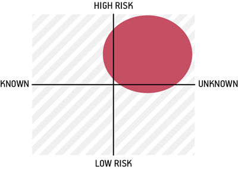
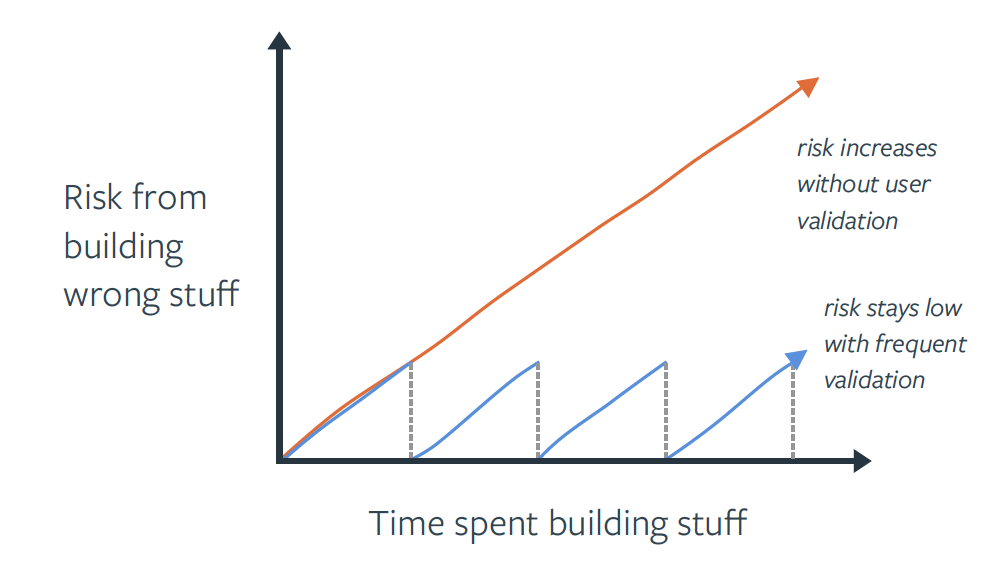

# Managing Assumptions & Risk

## What is it?

An assumption is something we take on faith or as a best guess despite a lack of proof, and can range from domain context, problems solutions, usability, technical feasibility, etc. Evidence can be on a scale from “wild guess” to having validated learnings from things like market research, user research, and actual results in production.

At Rise8, **risk management = assumption management**. Every assumption we make—from “users will adopt this flow” to “this service can handle 10k RPS” to “the AO will accept this control implementation”—carries risk because it’s not guaranteed. Our practice is to surface risks early and often, quantify their impact, track them, and deliberately burn them down through experiments, engineering practices, and operational guardrails—so we ship outcomes in prod with confidence and pace.

We use a few shared lenses to keep everyone aligned:

* **Product risks**: value, usability, feasibility, and mission/business viability.
* **Security & privacy risks**: managed with NIST’s Risk Management Framework (categorize → select/implement/assess controls → authorize → continuously monitor).
* **Reliability risks**: governed by SLOs and error budgets to balance speed with stability.
* **Project risks**: the skills, headcount, and availability of our team as well as the stakeholder landscape and relationships are setting us up for success.

Throughout a product’s lifecycle, it’s helpful for teams to articulate, prioritize and track and regularly revisit these assumptions. If you haven’t released software in awhile, your product is likely full of risks and assumptions. This can especially be the case early in a product’s lifecycle if you're delivering an MVP experiment. 

Check out the [Assumptions Workshop \- Delivery Playbooks](https://delivery-playbooks.rise8.us/content/plays/design/assumptions-workshop/) for an in depth how to.

## Why do it?

* **Outcomes over outputs** - Writing down the assumptions and risks about the product, our users, technical feasibility, dependencies, solutions etc. helps the team gain a shared understanding of what underlying beliefs the team has about what needs to be true in order for a product or our current project to be successful.
* **Learning velocity** - Systematic assumption testing and continuous delivery reduce the cost and risk of change—empowering us to learn in prod.
* **Mission and compliance** - RMF + continuous monitoring turns security/privacy risk into a daily habit, not a once-a-year scramble; it’s also foundational to cATO. 
* **Prioritize resource energy** - It’s important to understand, as a team, which assumptions are the riskiest (i.e. which ones, if proven wrong, could risk the success of our product or current project) so you can engage in activities to help de-risk those assumptions.
* **Maintaining flow** - Tracking the assumptions and the evidence that adds validity (or removes validity) to the assumption is helpful in making decisions on whether to pivot or persevere. If a key assumption you made early on in the product life cycle turns out to be incorrect- it’s important to evaluate how that assumption being invalidated informs what you do next as a product team.
* **Comfortable accepting risk** - Tracking and de-risking assumptions also allows teams to feel more confident that the product they’re building and releasing will be desirable, viable & feasible to build.

## How to do it?

### Facilitate a recurring conversation

Assumption and risk management starts with a facilitated conversation that focuses on generating concerns that may cause us to not meet our goals, or not achieve desirable outcomes in production with our customers. Whether you're using sticky notes, or a digital whiteboarding solution, we recommend checking out our [Assumptions Workshop Play](https://delivery-playbooks.rise8.us/content/plays/design/assumptions-workshop/) for a detailed guide on how to facilitate this conversation. Running this formal exercise should happen as often as the team makes strategic prioritization decisions, because managing risk is a critical component of establishing and managing strategy.

### Assumptions and risk register tracking

Wehther you're completeing formal exercises, or simply recognizing new datapoints and context surfacing on a daily basis, it's important that delivery teams  

Assumptions/Risks Register Tracker

## Assumption Writing Tips:

* Try to frame assumptions in the positive (even if you’re not super confident in them).
    * Examples:
    * We believe users will be able to find the upload folder
    * We believe that operators need a way to help schedule taskings
    * We believe that we’ll be able to establish a continuous CI/CD pipeline in 3 months

* Try to think about all aspects of a product:
    * Usability
    * Feasibility
    * Viability
    * Desirability
    * Etc..

* If you can, write down any evidence you may have for or against a particular assumption.  Example:

### Relevant Links

[Assumptions Workshop \- Delivery Playbooks](https://delivery-playbooks.rise8.us/content/plays/design/assumptions-workshop/)

[Tracking Research Questions, Assumptions, and Facts in Agile](https://www.nngroup.com/articles/tracking-questions-assumptions-facts-agile/)
