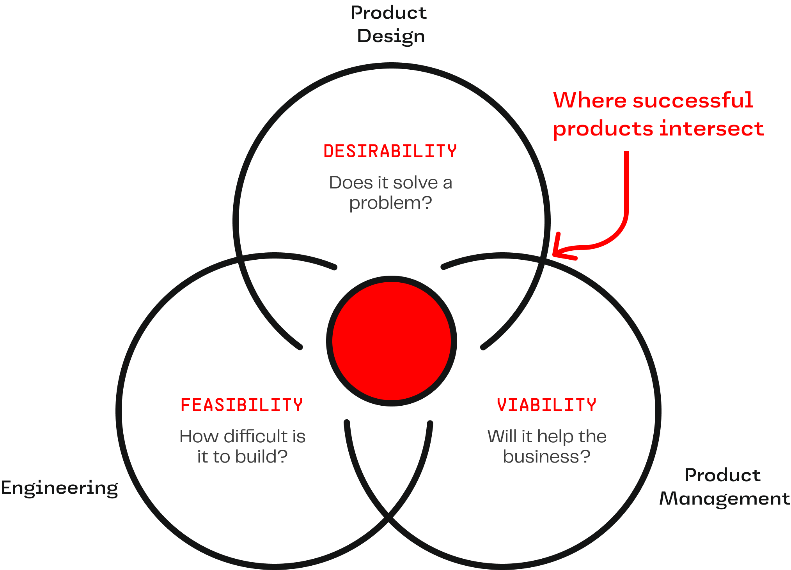

# Balanced Teams 

## What Is It?
At Rise8, a balanced team refers to structuring a team with a cross-functional group of individuals that bring diverse skills, perspectives, and responsibilities to collaboratively work together within the construct of a team. This concept emphasizes the importance of having a mix of technical, end-user, and business/mission expertise within a team.

A typical balanced delivery team includes the roles of engineers, product designers and product managers. Depending on the project, additional roles such as subject matter experts, content writers, researchers, and data analysts may be of value to include in the balanced team.

## Why Do It?
By building a team of cross-functional roles, it enables tight feedback loops between different functional perspectives, leads to better problem solving, greater quality, and unlocks a level of autonomy where teams fully own their product or service without outside dependencies.

### Enhanced Problem Solving

The diversity of skills and perspectives allows for more creative and effective problem-solving. Different viewpoints can lead to innovative solutions that might not emerge from a more homogenous group. 

### Improved Product Quality 

The combination of technical, design, and business insights contributes to the development of products that are not only functional but also user-friendly, desirable, feasible, and viable in the market.

### Faster Learning and Adaptation

A culture of cross-functional learning and collaboration enables team members to gain insight into expertise from other roles, acquire new skills, and adapt to feedback more quickly.

### Greater Team Autonomy

Because balanced teams have representation from all necessary functional groups, they are able to fully own their product or service and make decisions around priorities, releases, features, etc. without having dependencies on other teams.

## Who’s Involved? 
We try our best to structure all teams at Rise8 as balanced teams. Every Riser representing every discipline in delivery should be involved and our balanced teams will likely include some clients too!

Some examples of how different roles on a team may play a part in the practice of the balanced team.

### Product Manager

The Product Manager (PM) builds interpersonal relationships with project stakeholders to empathize with their needs, align to their goals, and craft a strategy and plan that steers the product direction. Product Managers collaborate with stakeholders to define success and determine how that success will be measured for the organization. In the balanced team, the Product Manager is typically the foremost expert on what the organization defines as success and brings that perspective to team decisions.

### Product Designer

The Product Designer (PD) is similar to a Product Manager in the way they build empathy with a group of people to represent them on the balanced team, but are focused on the end-users of the product or service. Designers utilize user research methods to gain deep insights into user problems and determine which solutions will be of value to the end-user. In addition to being the foremost expert on user value (desirability) in the balanced team, Product Designers also focus on creating experiences which are usable and accessible to their user group(s). When making decisions within the balanced team, designers represent users and their needs.

### Engineer

The Engineer is responsible for the technical implementation and delivery of a product to a user. In the balanced team, Engineers are the experts when it comes to which technologies are available and which are the best fit to solve user and business problems. Engineers represent the feasibility of implementing solutions on the balanced team. They are able to speak to capabilities, what is possible, and estimate the complexity of different technical implementations.

## When To Do It?
At Rise8 we believe that every team should be a balanced team. Although it may be more challenging to accomplish in some organizations than others, we believe the benefits of structuring teams in this way is worth striving for on every team.

We try to set up engagements to have balanced teams whenever possible.

### Healthy Tensions Between Roles

What’s best for an end-user isn’t always the simplest to technically build. What’s the simplest to build isn’t always viable for the organization. There should be direct tensions between roles within a balanced team. These tension points are areas where balanced teams truly shine. Because everyone is on the same team, oriented toward the same goals, these tensions become opportunities for deeper understanding and collaboration across roles to build the absolute best product or service which will be universally successful. This is a markedly different model than other constructs where one role on the team makes all product decisions. In balanced teams, the team owns the successes and failures of their product or service and they collaborate together to make product decisions.

## Relevant Links
*  [Balanced Teams](https://www.youtube.com/watch?v=Z_Q4Q8rCVpU) by Janice Fraser
*  [How to build better software with Balanced Teams whitepaper](https://tanzu.vmware.com/content/white-papers/how-to-build-better-software-with-balanced-teams) by VMware Tanzu Labs

