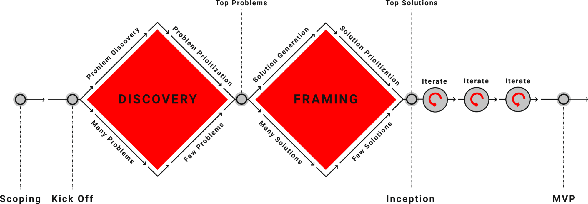

# Discovery & Framing (D&F)

## What Is it?
The Discovery and Framing (D&F, D+F, DnF) Practice is based on the "Double Diamond" approach; a problem solving framework that represents a methodical way of tackling problems and developing solutions. When we say "Discovery & Framing" at Rise8, we're referring to an up-front research phase before we start true iterative delivery. D+Fs should be timeboxed (typically 2-4 weeks) to ensure you balance making forward progress with doing just enough research to ensure your project has a solid foundation.

As a former design mentor once put it, 
> You want to learn just enough to make sure you’re not about to build your house on a bog.

If you’re building a house, you have to start with the foundation. You want to make sure you’re on solid ground before thinking about details of the house itself. If you’re staring at an empty lot and thinking about the color of drapes you want in your second bedroom - you’re likely getting way too far ahead of yourself. 

The Double Diamond was developed by the British Design Council in 2005 and is widely used in the fields of design and innovation. The process is visualized as two diamonds. 

### Two key design principles represented in the Double Diamond
#### Problems before solutions
> Make sure you have a good understanding of the problems you’re tackling before jumping into the solutions.

#### Diverge before converging
> Make sure you are “casting a wide enough net” to explore possibilities before honing in  
> _You use different parts of your brain when doing divergent vs convergent thinking. Doing both at the same time stifles creativity - “Kill the censor!” for the best ideas_

There are 4 key modalities of a Double Diamond (and D+F). Although you progress through them in order, depending on what you find, you may end up back-tracking as you learn about new risks. Catch [a video explanation here for a deeper dive](https://www.loom.com/share/994f11510ae647beb48f5b0e51960f84?sid=5b765940-7f2d-4663-a106-a68567c96c4e).

### Problem Discovery: 
The first diamond begins with the problem discovery phase, where the aim is to understand the problem or opportunity. This involves open-minded research and exploration, gathering insights, and empathizing with users, customers and stakeholders. 

### Problem Prioritization: 
The second stage is where problems are defined, synthesized and prioritized. The goal here is to identify the core problem or opportunity that needs to be addressed. This phase narrows down the focus to a clear, well-defined problem statement that guides the rest of the process.

### Solution Generation: 
The third stage marks the beginning of the second diamond, starting with the Develop phase. This is where ideas are generated, exploring a wide range of possible solutions to the defined problem.

### Solution Prioritization: 
This stage is where the best solution or solutions identified during the solution generation phase are finalized, prioritized and refined. 

### Workshopping and D+Fs
We use a toolbox of different workshops (find some in our Plays section) to help navigate the different parts of the Double Diamond. These facilitated workshops are especially helpful to understand the stakeholder landscape, empathize with users, brainstorm solutions, and make prioritization decisions.

Check out our videos explaining [some possible D+F activities](https://www.loom.com/share/0dc3451210404aee8fae15fb1cd276f4?sid=926e57e2-9f00-474a-8a0f-2111cf176c75) and a [baseline recipe for how to run a Discovery & Framing](https://www.loom.com/share/6d258c44a1c7461581b39200a5f2c8d8?sid=1ad617f7-0080-431f-8551-74267e2811d7) if you need help getting started.

## Why Do It?
By doing a timeboxed phase of up-front research following this framework (a D+F) we can test the riskiest hypothesis before embarking on development.

The Double Diamond approach emphasizes the importance of both divergent and convergent thinking at different stages of the problem solving process. In the problem discovery and solution generation phases, divergent thinking expands the field of exploration to generate a wide range of ideas and possibilities. 
In the problem prioritization and solution prioritization phases, convergent thinking helps narrow down these options to define clear objectives and deliver targeted, effective solutions.

> _Continuous Discovery (executing mini double diamonds once you’ve started product development) will continue to happen in parallel to development as you explore new opportunities. To revist the bog analogy, that’s when we’ll figure out the color of the drapes. It should come later, once we have a foundation, actual rooms, and some paint on the walls._

## Who’s Involved? 
Because the double diamond is a problem solving framework at its core it can be used by anyone, in any role to approach solving a variety of different problems.

### [Balanced Team](./balanced-team.md) Roles and Responsibilities in a D+F

#### Product Managers
Product Managers should lead engagements with stakeholders (e.g. Stakeholder Interviews) to understand organizational structure, needs, and goals as well as define metrics for success. While thinking about success, Product Managers should also be thinking about risks and work with the team to figure out mitigation strategies. They help define product hypothesis and shape the MVP using plays such as User Story Mapping. Product Managers spend focused D+F time understanding what will make the project a success (organizationally, to meet mission needs) and define an Outcome Oriented Roadmap that maps changes in user behavior (outcomes) to organizational impact.

#### Designers
Designers should lead user engagements to map out user journeys and understand end-user pain points. Designers use research tools like contextual inquiry, user interviews, and surveys to empathize with users and create artifacts such as personas and workflow maps to tell a compelling story from synthesized research. Designers typically lead workshops such as Design Studios to explore solutions and get feedback from Product Managers, Engineers, and end-users to define a successful Balanced Team product/service. 

#### Engineers
Engineers take the lead on understanding feasibility of building solutions in the ecosystem. During a D+F, engineers may explore the software ecosystem, learn what services and libraries are available for use and may even create some proof of concept ideas to de-risk hypothesis around feasibility. Engineers shadow interviews and take part in solution brainstorming activities and help provide feedback to ensure feasibility of building the product/service.

## When To Do It?
A Discovery & Framing is a service Rise8 offers as an up-front research phase to de-risk hypothesis before beginning development work. They are typically timboexed to be the first 4 weeks of a brand new project.

You should use the _Double Diamond framework_ continuously (known as continuous discovery) as you explore new project opportunities. A D+F is just one large Double Diamond up-front research phase before beginning development.     

## Relevant Links
* [The Double Diamond](https://www.designcouncil.org.uk/our-resources/the-double-diamond/) - The Design Council

* [Discovery and Framing Kick Off](https://delivery-playbooks.rise8.us/content/plays/cross-discipline/discovery-framing-remote/)
