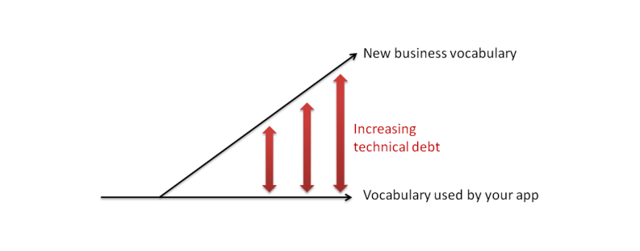
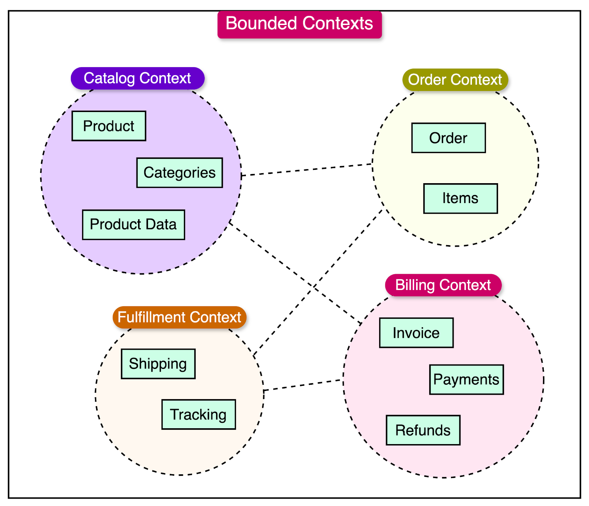

# Domain Driven Design (DDD)

## What is it?

Domain-Driven Design (DDD) is a software development approach that focuses on understanding and modeling the business domain as the foundation for creating complex software systems. 

DDD is a deep subject, but the most important concept is using the same language as the business to bridge the gap between technical and non-technical, and mapping out the business domains (or chunks) so that software architecture mimics how the business operates.

Key concepts of Domain-Driven Design include:

### Ubiquitous Language 
The goal is to establish a common language for everyone involved.

* A common language shared between developers and domain experts.  
* Uses business terminology consistently throughout the codebase  
* Helps bridge the communication gap between technical and non-technical stakeholders  

### Domain Modeling / Bounded Contexts   
Design code abstractions to closely mirror the business's organizational structure, objects, and operational workflows

* Explicit boundaries that define where specific models and terms apply  
* Helps manage complexity by dividing large systems into smaller, manageable contexts  
* Each context can have its own model and implementation

### Strategic Design Patterns   
It offers a framework for breaking down intricate business structures into digestible chunks, specifically domains and bounded contexts

* Context Mapping: Defining relationships between different bounded contexts  
* Core Domain: Identifying and focusing on the most valuable part of your system  
* Subdomains: Breaking down complex domains into manageable pieces

### Tactical Design Patterns   
DDD gives advice on how to do object oriented programming to ensure seperating the important business domain logic from infrastructure code.

* Entities: Objects with a distinct identity that runs through time  
* Value Objects: Objects that describe characteristics but have no identity  
* Aggregates: Clusters of domain objects treated as a single unit  
* Repositories: Handle object persistence and retrieval  
* Domain Events: Capture significant changes in the domain

## Why do it?

Rise8 includes DDD practices for various reasons, DDD is a better way of expressing the business domain in software.  DDD gives the framework and tools to better understand, and design software for our clients.

The benefits of DDD primarily center on aligning technical solutions with core business needs. This approach fosters improved communication among stakeholders, leading to a more maintainable and flexible codebase. DDD provides clearer boundaries between system components, enhancing focus on delivering tangible business value. The resulting advantages include reduced maintenance costs, fewer bugs due to a deeper understanding of the domain, and streamlined onboarding for new team members. Furthermore, DDD promotes a flexible and adaptable architecture, ensuring better alignment with evolving business goals and ultimately improving the overall system architecture

You should consider Domain-Driven Design (DDD) for the following compelling reasons  
   
**Reduce Complexity of Business Logic**

* Make code around complex business rules and workflows easier to read  
* Simplify the business domain is the core value proposition  
* Model sophisticated business processes accurately

**Better Communication & Collaboration**

* Creates a shared language (Ubiquitous Language) between developers and domain experts  
* Reduces misunderstandings and requirements gaps  
* Improves collaboration between technical and non-technical stakeholders  
* Makes business requirements more traceable in the code

**Maintainable Software Architecture**

* Clearly separates concerns through Bounded Contexts  
* Makes the system more modular and easier to modify  
* Reduces technical debt through better organization  
* Easier to test due to clear boundaries and responsibilities

**Scalability Benefits**

* Natural fit for microservices architecture  
* Easier to identify services boundaries  
* Better handling of distributed systems  
* More straightforward to scale specific parts of the system

**Business Value Focus**

* Aligns technical solutions with business objectives  
* Prioritizes core domain development  
* Makes business rules explicit in the code  
* Easier to adapt to changing business needs

### DDD sounds great, what’s the catch?

Domain-Driven Design (DDD), while powerful for complex domains, doesn't need to be fully applied in every context. In simple software applications, where the business logic is minimal and straightforward, some parts of DDD will likely be overkill for what's needed.

DDD gives low level technical details about how to code (i.e. tactical design patterns) and can be difficult to understand / implement.  These tactical design patterns can be controversial amongst developers.  Following them strictly may not be necessary  or may vary on the level of value they return. Ubiquitous language, context mapping, and strategic design patterns are core Rise8 practices, DDD tactical design patterns such as ensuring everything is a proper entity, value object, or using aggregate aren't (but some complex situations may benefit from them).

Similarly, if a domain is well-understood and stable, the overhead of to re-architect toward DDD might outweigh its benefits. Teams should weigh the cost and benefits of applying DDD practices on their team.

### Relevant Links

* [Ubiquitous Language: The joy of naming](https://medium.com/carbon-five/ubiquitous-language-the-joy-of-naming-d453362be76b)  
* "Domain-Driven Design: Tackling Complexity in the Heart of Software." \- Eric Evans  
