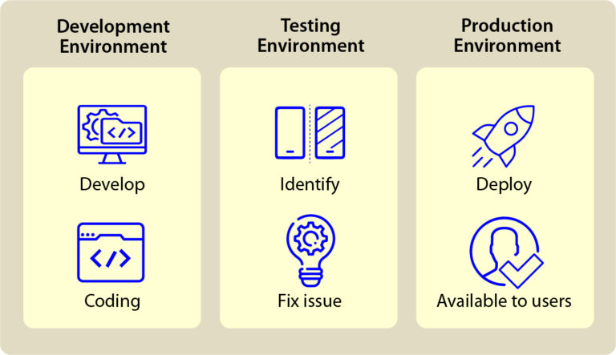

# Environment Control

## What is it?

Environment control is a critical practice that ensures consistency of infrastructure, dependencies, and configurations across environments (development, staging, and production). We do this by using tools and automation to manage environments locally and in the cloud, guaranteeing that applications are deployed and run uniformly. This practice revolves around **standardization** and **templatization** to minimize discrepancies and streamline deployments and operations.

### Standardization

Developers use standard tools like Docker, Kubernetes (K8s), and Terraform to ensure consistency in how applications are deployed and run across different cloud environments. Docker enables the creation of containerized applications that can run across platforms. K8s orchestrates those containers, ensuring they scale and run reliably. Lastly, terraform manages the creation of cloud-specific infrastructure (e.g., AWS EC2 instances, Azure Virtual Machines, GCP Compute Engines), maintaining consistency in how environments are provisioned. Developers use many other tools too, but these are a good starting point.

### Templatization

Templatization involves creating configuration files (e.g., YAML, JSON) to define environment-specific settings such as security credentials, identity provider configurations, database URLs, feature flags, and application versions. By using templates, these settings can be adjusted without changing the application’s core code, making it easier to configure environments quickly and reducing the risk of errors due to inconsistent configurations. It is important to consider templatization when you:

- Create new features by introducing feature flags  
- Add a new service by updating K8s manifests and helm charts and create new docker images if the service is managed and built by app team  
- Create new environments (demo, A/B environments, etc) which requires updating terraform files, K8s manifests and helm charts.

## Why do it?

The benefits of practicing environment control comes from **consistency across environments**. As a product team, we need the ability to experiment with building new features in development, demo or perform acceptance testing in acceptance, and replicate bugs found in production. Environment control brings **easier scaling** as configuration changes are much easier to perform. Additionally, this practice brings better **security** and compliance, where permissions and encryption settings are consistently applied. One of the caveats to proper environment control is that application developers have as much access to their tech stack as possible, especially cloud Infrastructure and K8s resources. Additionally, proper environment control takes more time initially to set up, which delays progress from being made on new features for the user, but leads to faster changes and more stability over the complete application lifecycle.

## Relevant Links

* [Navigating the Dev vs Prod Environment: Best Practices and Key Considerations \- Webisoft Blog](https://webisoft.com/articles/dev-vs-prod/)  
* [What Is Terraform And Why Is It Needed? \- GovCIO](https://govcio.com/resources/article/what-is-terraform-and-why-is-it-needed/)  
* [What is Helm? A complete guide | CircleCI](https://circleci.com/blog/what-is-helm/)  
* [What is a Container? | Docker](https://www.docker.com/resources/what-container/)
