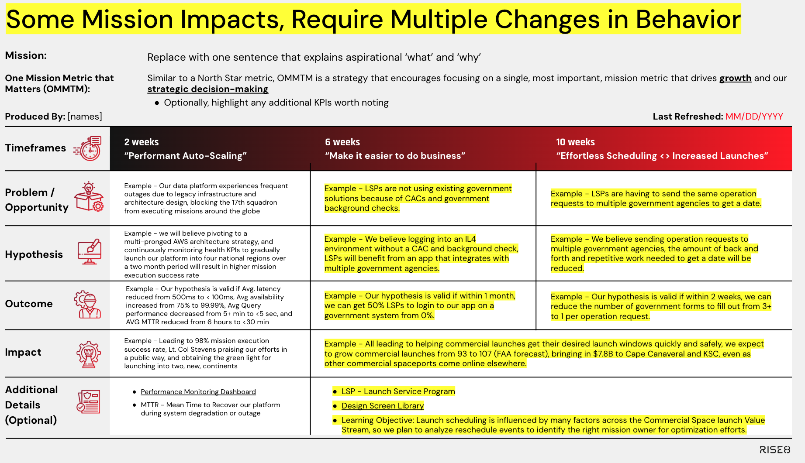
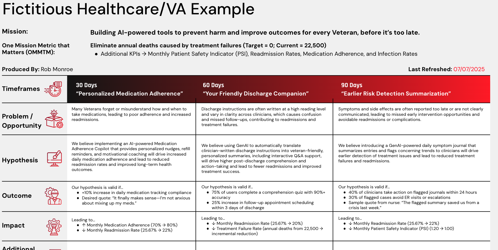

# Outcome Oriented Roadmaps

## What is it?
A strategy communication tool that highlights prioritized experiments with expected outcomes and mission/business impacts. Outcome-oriented Roadmaps help align execution plansto our overall Mission and One Mission Metric That Matters (OMMTM). At Rise8, Outcomes in Prod are categorized as either ***supporting*** (creating opportunities to enable user-facing outcomes; enabling continuous delivery for an organization is a classic example) or ***user-facing*** (generating value for civilians, operators, or warfighters, and thus achieving the actual customer mission). An Outcome in Prod is considered, a measurable change in user or system behavior (ie outcome), and leads to measurable mission/business results (ie impact).

Every outcome-in-prod hypothesis experiment includes components that mimic the scientific method.

* **Problem/Opportunity:** a succinct explanation of how our user or system persona’s goals/wants/needs are not being met (think jobs to be done), and how that currently impacts the mission.
* **Hypothesis:** a succinct narrative of what we will do/build, and how we believe that will change user/system behavior, thus leading to mission impacts. 

> ***“We believe [output(s) → solutions we plan to do/build], will drive [outcome → a desired user/system behavior change] and lead to [mission impact → a result that is generated].”***

* **Outcome:** The measurable evidence we expect to observe for user or system behavior changes (think leading indicator)

> ***"Our hypothesis is valid if…[replace with quantitative and/or qualitative measures of user/system behavior change]"***

* **Impact:** The measurable evidence we expect to observe for mission/business impact (think lagging indicator) 

> ***"Leading to…[replace with quantitative and/or qualitative measures of mission impact]"***

### Uncertainty in a Roadmap

Typically, the further out something is on a roadmap, the less certain we are about it. Product Managers and Product Designers pair to structure research efforts that bring clarity to roadmap items as the team works toward them. This continuous discovery of future opportunities weaves into continuous delivery sometimes known as “dual track agile.” We recommend highlighting learning objectives under "Additional Details" to indicate additional insights we hope to capture and utilize for framing future opportunities.

## Why do it?

By building a roadmap centered around outcomes (rather than outputs), teams are able to align with stakeholders on what success looks like without being tied to any particular solution. Success is defined around the desired change in user or system behavior, and we detach that change from the solutions which may get us there. This flexibility is key for agile development as it allows teams to set goals early, independent from knowing how exactly they will actually achieve success. This reinforces design thinking practices and allows teams to explore the whole solution space and reframe solution outputs as experiments centered around product assumptions. Aligning around outcomes with leadership has the additional benefit of keeping autonomy at the team level; teams can best determine how to achieve the outcome leveraging the balanced team perspective to find a successful solution.

Outcome Oriented Roadmaps

* Align our team’s day-to-day work with the product vision and strategy
* Maintain our focus goals that matter right now, and that will help move metrics incrementally
* Prioritize based on business/mission & user value
* Establish and maintain stakeholder and cross-team alignment, collaboration and visibility
* Leveraged to help create and prioritize our backlogs

## When to do it?

The following is not an exhaustive list, but should cover the majority of scenarios that a product team may encounter:

* You’ve joined a team that is deep into development, and there is no roadmap
* The prioritized backlog is not aligned to support prioritized goals
* As you are closing out Discovery & Framing (D\&F), and have settled on a product vision, and prioritized goal(s), user(s), problem(s) and a solution
* On a time-based cadence (e.g. monthly or quarterly) that aligns with your teams approach to delivery
* On an event-based cadence where each release produces empirical evidence that immediately informs prioritization decisions for the next experiment

## What does a good Outcome-oriented Roadmap look like?

The following acceptance criteria has been provided to assist all delivery teams in self-evaluating if there is more work to be done to improve the efficacy of our planned outcomes in prod:

***Problem/Opportunity: Are the following clear and succinct?***

* System or User Persona w/ pain,need, or goal
* How that is currently impacting the mission
* Ideally highlighting baselined qual./quant. Metrics

***Hypothesis: The following format is adopted, clear and concise:***

* “We believe [activities, outputs, and experiment parameters] will result in [ideal behavior and mission changes]”

***Outcome: The following format is adopted, clear and concise:***

* “Our hypothesis is valid if… [replace with measurable user/system behavior change(s)]”
* Preferably, highlight the shift from metric baseline “x” to target “y”

***Impact: The following format is adopted, clear and concise:***

* “Leading to…[replace with measurable business/program/mission impact(s)]”
* Never repeats Outcome success criteria above
* More time for x" assumes that more of what is valuable is being accomplished - prove it!
* Preferably, highlight the shift from metric baseline “x” to target “y”

### Some Mission/Business Impacts Require Multiple Outcomes

Sometimes we have to solve two problems, or adjust two behaviors, in order to achieve the desired mission/business impact. Below demonstrates a clear example between the sixth and tenth week of our roadmap

### Example of a good Outcome-oriented Roadmap

## Lean Product Canvas Can Identify Gaps in Strategy

A Lean Product Canvas is a one-page, problem-solution-fit framework designed to help delivery teams systematically evaluate and validate their riskiest assumptions before focusing on product-market-fit. Adapted from the Lean Business Model Canvas, it focuses on the essential elements of a product or service strategy which can also help identify gaps. The following are key components of a Lean Product Canvas:

### Relevant Links

* [Rise8 Standard Outcome-oriented Roadmap Template (Internal Link)](https://docs.google.com/presentation/d/1jypCNSf423-zyKfJMS2zQ5_a9cZUOLtTE8xbD-7jo7A/edit?slide=id.g33b9f42ef8b_0_1227&pli=1#slide=id.g33b9f42ef8b_0_1227)
* [Acceptance Criteria - "What good looks like" (Internal Link)](https://docs.google.com/presentation/d/1jypCNSf423-zyKfJMS2zQ5_a9cZUOLtTE8xbD-7jo7A/edit?slide=id.g36322af4c1d_1_83&pli=1#slide=id.g36322af4c1d_1_83)
* [Lean Business Model Canvas](https://labspractices.com/practices/lean-business-canvas/)
* [Why “MVP” is Confusing](https://tajmo.medium.com/why-mvp-is-a-contronym-40af0fcb74c0)
* [SVP: The Shoddiest Viable Product](https://blogs.vmware.com/tanzu/svp-the-shoddiest-viable-product/)
