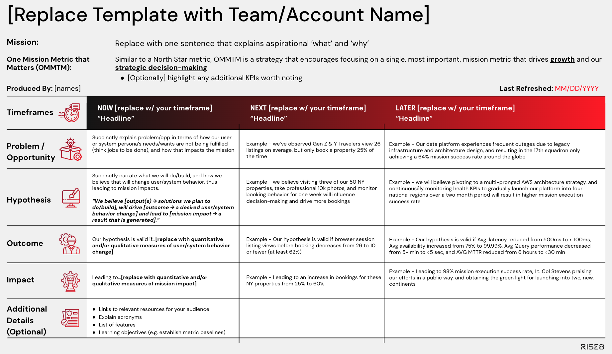

# Outcome Oriented Roadmaps

## What is it?
A communication and planning tool that shows sequential experiments with expected outcomes and business or mission impacts, that help execute against your strategy and build towards your vision. At Rise8, Outcomes are categorized as either ***supporting*** (creating value for internal teams) or ***user-facing*** (creating value for civilians, operators, or warfighters), and if we successfully witness user or system behavior change outcomes, we also expect that to drive meaningful business or mission impact.

Every outcome-in-prod hypothesis experiment includes components that mimic the scientific method.

* A **problem/opportunity** statement anchors to both user sentiment and the impact to the business/mission, that is caused by current challenges and behaviors
* The **test** will outline our hypothesis, based on the thing we will build, do, or make in order to validate our assumption(s). Here is where we should clarify critical parameters that inform what will produce a confident test result (e.g. volume or quantity of data, segments, time, etc.)
* Our hypothesis is valid if we see a measurable behavior change for our users or system (i.e. an increase or decrease from X to Y) as the **outcome**
* And we expect this will result in a measurable **business or mission impact**

### Lean Product Canvas

A Lean Product Canvas is a one-page, problem-solution-fit template designed to help entrepreneurs and product teams systematically evaluate and validate their riskiest assumptions before focusing on product-market-fit. Adapted from the Lean Business Model Canvas, it focuses specifically on the essential elements of a product strategy while aligning with lean and agile principles. The following are key components of a Lean Product Canvas:

### Uncertainty in a Roadmap

Typically, the further out something is on a roadmap, the less certain we are about it. Product Managers and Product Designers pair to structure research efforts that bring clarity to roadmap items as the team works toward them. This continuous discovery of future opportunities weaves into continuous delivery sometimes known as “dual track agile.” Teams practicing continuous discovery alongside continuous delivery are learning about the product they just delivered alongside learning about other product opportunities to inform the future roadmap.

## Why do it?

By building a roadmap centered around outcomes (rather than outputs), teams are able to align with stakeholders on what success looks like without being tied to any particular solution. Success is defined around the desired change in user behavior and we detach that change from the solutions which may get us there. This flexibility is key for agile development as it allows teams to set goals early, independent from knowing how exactly they will actually achieve success. This reinforces design thinking practices and allows teams to explore the whole solution space and reframe solution outputs as experiments centered around product assumptions. Aligning around outcomes with leadership has the additional benefit of keeping autonomy at the team level; teams can best determine how to achieve the outcome leveraging the balanced team perspective to find a successful solution.

Outcome Oriented Roadmaps

* Align our team’s day-to-day work with the product vision and strategy
* Maintain our focus goals that matter right now, and that will help move metrics incrementally
* Prioritize based on business/mission & user value
* Establish and maintain stakeholder and cross-team alignment, collaboration and visibility
* Leveraged to help create and prioritize our backlogs

## When do it?

The following is not an exhaustive list, but should cover the majority of scenarios that a product team may encounter

* You’ve joined a team that is deep into development, and there is no roadmap
* The prioritized backlog is not aligned to support prioritized goals
* As you are closing out Discovery & Framing (D\&F), and have settled on a product vision, and prioritized goal(s), user(s), problem(s) and a solution
* On a time-based cadence (e.g. monthly or quarterly) that aligns with your teams approach to delivery
* On an event-based cadence where each release produces empirical evidence that immediately informs prioritization decisions for the next experiment

### Relevant Links

* [Rise8 Standard Outcome Oriented Roadmaps (Internal Link)](https://docs.google.com/presentation/d/1jypCNSf423-zyKfJMS2zQ5_a9cZUOLtTE8xbD-7jo7A/edit#slide=id.g30b2d31cd4f_0_0)
* [Lean Business Model Canvas](https://labspractices.com/practices/lean-business-canvas/)
* [Why “MVP” is Confusing](https://tajmo.medium.com/why-mvp-is-a-contronym-40af0fcb74c0)
* [SVP: The Shoddiest Viable Product](https://blogs.vmware.com/tanzu/svp-the-shoddiest-viable-product/)
