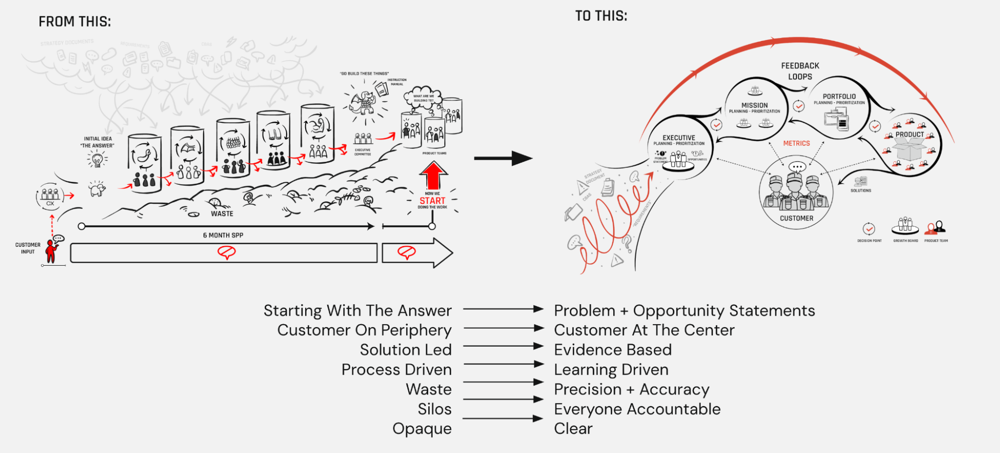

# Strategic Planning

## What is it?

Strategic planning is the process of setting a clear direction for an organization, defining priorities, and aligning resources to achieve meaningful outcomes. Unlike traditional long-term planning, Lean strategic planning is dynamic, iterative, and focused on continuous learning.

In a Lean Enterprise, strategic planning is not just a one-time exercise—it’s a continuous process of hypothesis-driven learning. Instead of rigid five-year plans, we embrace right-sized experimentation, rapid feedback loops, and data-driven decision-making to pivot when necessary.

## Why do it?

#### 1. Focus on Outcomes, Not Just Outputs

Traditional planning often focuses on deliverables: "We will build X feature by Y date." However, Lean strategic planning asks a more important question: What is the real problem we are solving?

At Rise8, our goal is not just to deliver software but to continuously deliver secure, high-quality software that users love. Strategic planning helps us ensure that every effort is aligned with delivering tangible value rather than just hitting milestones.

#### 2. Reduce Risk Through Continuous Learning

One of the biggest challenges in large-scale government projects is risk—both in terms of security and usability. A Lean approach to strategic planning mitigates risk by emphasizing small, incremental changes over large, risky bets.

By working in short cycles, getting user feedback early, and testing assumptions before full-scale implementation, we can de-risk our initiatives. This is particularly crucial in government, where security and compliance requirements often slow down progress.

#### 3. Adapt Quickly to Changing Needs

The government’s needs and priorities evolve based on emerging threats, policy changes, and shifting user demands. Lean strategic planning enables us to stay responsive and flexible, rather than being locked into outdated plans.

Instead of spending months developing a product only to realize it doesn’t meet the mission’s needs, we work iteratively—learning, adapting, and improving continuously.

#### 4. Align Teams and Create Autonomy

A clear strategy provides teams with a shared mission while allowing autonomy in execution. At Rise8, we empower teams to make decisions within a strategic framework rather than micromanaging every detail.

By defining measures for success up front, we ensure that teams can move fast while staying aligned with the broader organizational mission. We do this by aligning and revisiting the following in our delivery efforts:

* North-star metrics (i.e. One Mission Metric that Matters) for long term focus
* Objectives and Key Results (OKRs) for deliberate short and long term bets
* Key Performance Indicators (KPIs) to ensure operations are performing as expected

## Planning Horizons: A Key Framework for Strategic Execution

While strategic planning provides the overarching vision, planning horizons help us break that vision down into manageable, actionable timeframes. The Lean Enterprise defines three primary planning horizons:

### Horizon 1: Near-Term Execution (0-12 months)

This horizon focuses on delivering value now. It includes:

* Incremental improvements to existing products and services
* Short feedback loops to validate assumptions
* Tactical adjustments based on real-time learning

*At Rise8, this is where we prioritize rapid iteration, ensuring secure and impactful software delivery to government agencies.*

### Horizon 2: Mid-Term Innovation (1-3 years)

This horizon balances scaling current success with exploring new opportunities. It includes:

* Refining and expanding successful initiatives
* Testing new approaches or technologies
* Addressing emerging user needs

*At Rise8, this means leveraging data insights to refine our transformation approach, ensuring that government teams can continuously improve their software delivery capabilities.*

### Horizon 3: Long-Term Vision (3+ years)

This horizon is about disruptive innovation and future-proofing. It includes:

* Exploring transformational changes
* Identifying major shifts in technology, policy, or mission priorities
* Laying the groundwork for large-scale advancements

*While long-term planning is inherently uncertain, a Lean mindset helps us stay adaptable and focused on high-impact opportunities.*

### Why Planning Horizons Matter

Leveraging planning horizons ensures that strategic planning remains actionable. Without them, long-term goals can feel too abstract, and short-term actions can become disconnected from the broader mission. By structuring strategy across these horizons, we can:

* Balance immediate impact with future vision
* Mitigate risk by aligning investments with proven outcomes
* Ensure agility by continuously reassessing priorities

### How to Leverage Planning Horizons Effectively

Align teams on a shared vision while allowing flexibility in execution

* Use real-time data to refine near-term plans and validate mid-term bets
* Encourage innovation while maintaining focus on delivering value today
* Reassess priorities regularly to ensure ongoing alignment with mission goals

## Managing Funding and Resources in a Lean Enterprise

A crucial aspect of strategic planning is how organizations allocate and manage resources—whether funding, talent, or infrastructure. In *The Lean Enterprise*, the authors emphasize that traditional funding models can be a major blocker to agility. Instead of annual budget cycles that lock teams into fixed outcomes, Lean enterprises adopt dynamic resource allocation strategies that support iterative development and continuous learning.

### Why Lean Resource Management Matters

1. **Aligns Investment with Value Delivery** – Instead of funding entire projects upfront, Lean funding models allocate resources incrementally based on validated outcomes.
2. **Enables Faster Experimentation** – Small, controlled investments allow teams to test assumptions and pivot as needed.
3. **Reduces Waste** – By funding ongoing experimentation rather than predefined solutions, organizations avoid sunk-cost fallacies and unnecessary spending.
4. **Empowers Teams** – Decentralized decision-making around funding gives teams the autonomy to respond quickly to emerging opportunities and challenges.

### How to Leverage Lean Funding and Resource Management

* **Adopt a Venture Capital Approach** – Fund initiatives based on learning outcome and impact results rather than rigid plans.
* **Prioritize Continuous Investment Over One-Time Budgets** – Support teams with rolling budgets that adapt to changing needs and measures for success.
* **Measure Success Based on Impact, Not Just Spend** – Focus on delivering meaningful outcomes rather than ensuring budgets are fully utilized.
* **Encourage Cross-Functional Collaboration** – Ensure funding decisions involve product, security, and technology leaders to align investments with mission priorities.

There is no one size fits all approach to accomplish this, and approaches may change based on the local context of your business/mission. One approach that can assist with environments that experience high degrees of uncertainty is to associate incremental funding decisions based on typical product/service assumption validation milestones.

* **Problem-solution-fit**: split metrics into 80% learning outcomes and 20% impacts
* **Product-market-fit**: split metrics into 50% learning outcomes and 50% impacts
* **Growth, Scale or Retire**: split metrics into 20% learning outcomes and 80% impacts

## Relevant Links

* [Lean Enterprise: How High Performance Organizations Innovate at Scale](https://www.amazon.com/Lean-Enterprise-Performance-Organizations-Innovate/dp/1492091774/ref=asc_df_1492091774?mcid=c240e8f520113d559564b318b8c6e14b&hvocijid=7156705907641986466-1492091774-&hvexpln=73&tag=hyprod-20&linkCode=df0&hvadid=721245378154&hvpos=&hvnetw=g&hvrand=7156705907641986466&hvpone=&hvptwo=&hvqmt=&hvdev=c&hvdvcmdl=&hvlocint=&hvlocphy=1020613&hvtargid=pla-2281435177378&psc=1)
* [Rise8 Digital Operating Model](https://www.loom.com/share/folder/d1517c2b077a40d3b50c42addafbbe0a) (Loom video series)
